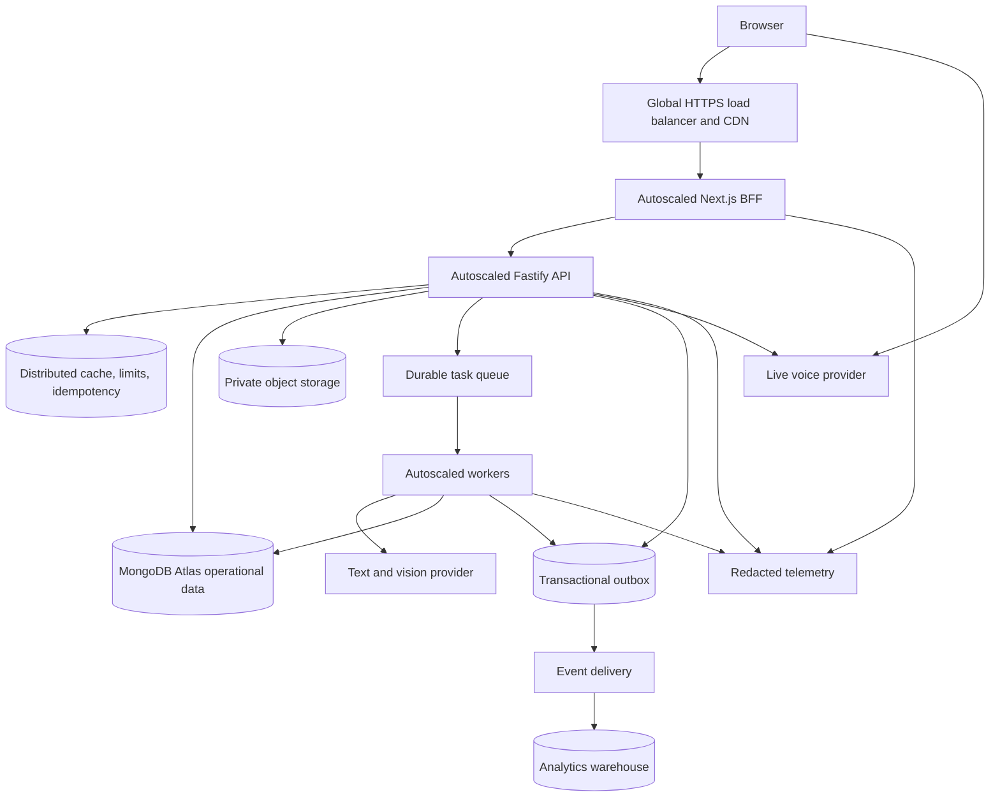

# Architecture revamp plan

Status: proposed
Branch: `feat/architecture-revamp`
Last updated: 2026-08-28

## 1. Objective

Evolve ForgeFit from a single-VM MVP into a production platform that can serve
one million registered members without rewriting the product into premature
microservices.

The architecture must preserve workout logging when optional AI, voice, avatar,
or analytics providers are unavailable. Language models may propose coaching
changes, but deterministic application code owns validation, confirmation,
persistence, and auditability.

## 2. Initial scale envelope

Registered accounts alone are not a useful capacity target. The first scale
envelope used for design and load tests is:

- 1,000,000 registered members.
- 100,000 daily active members.
- 10,000 concurrently active browser sessions at peak.
- 1,000 core API requests per second at peak.
- 50 text-coach turns per second, protected by admission control.
- 1,000 concurrent live-voice sessions, subject to contracted provider capacity.
- 99.9% monthly availability for authentication, plans, and workout logging.
- 99.5% monthly availability for optional AI coaching surfaces.
- p95 below 400 ms for non-AI reads and writes within the primary region.

These are engineering assumptions, not traffic promises. They must be replaced
with measured concurrency, payload, provider-latency, and retention data as the
product grows.

## 3. Non-negotiable invariants

1. The authenticated user ID comes only from verified authentication context.
2. Core training workflows do not depend on an AI provider being available.
3. Every externally retried mutation is idempotent.
4. Every plan mutation checks a plan revision and records an audit event.
5. A model never writes a plan directly; it returns a bounded proposal.
6. The member sees an exact before/after diff and explicitly confirms it.
7. Calendar dates use the member's persisted IANA timezone; event timestamps use UTC.
8. Raw camera streams and pose landmarks remain on device.
9. Binary media is not stored in the operational database.
10. Sensitive free text, tokens, images, and audio never enter logs or analytics.

## 4. Target runtime architecture



### Deployment choices

- Use separate autoscaled Cloud Run services for `frontend`, `api`, and
  `worker`. Keep a minimum instance count for the frontend and core API.
- Put Cloud Load Balancing and Cloud CDN in front of the frontend and static
  exercise assets.
- Retain MongoDB Atlas as the transactional operational store in the primary
  region. Use a production replica set, point-in-time recovery, tested restores,
  and separate Auth.js/application credentials.
- Introduce a Redis-compatible distributed service for rate limits,
  idempotency, small read caches, concurrency budgets, and provider quotas.
- Use Cloud Tasks for retryable commands such as plan generation. Introduce
  Pub/Sub only when one domain event needs multiple independent consumers.
- Store attachments in private Cloud Storage using short-lived signed upload
  and download URLs. MongoDB stores metadata and ownership only.
- Export redacted OpenTelemetry traces, metrics, and structured logs. Add an
  error-monitoring product only with server-side sensitive-data filters.

The selected products are adapters. Domain modules depend on small interfaces
for queues, object storage, cache, model providers, and telemetry.

## 5. Application boundaries

Keep one API deployable initially, but enforce these module boundaries:

| Module | Owns | Must not own |
| --- | --- | --- |
| Identity | Auth mapping and member lifecycle | Fitness records |
| Profile | Preferences, timezone, equipment, goals | Plan generation jobs |
| Programs | Plan versions, workouts, adjustment proposals | AI conversations |
| Training | Active sessions, sets, substitutions, completion | Plan generation |
| Coaching | Threads, messages, bounded AI context | Direct plan writes |
| AI jobs | Provider calls, validation, retry state | HTTP authentication |
| Media | Attachment metadata and signed access | Binary blobs in MongoDB |
| Progress | Weekly/lifetime read models | Workout command handling |

Extract a module into another service only when it requires independent scaling,
availability, data ownership, or release cadence. The first likely extraction is
the AI worker, not the training transaction path.

## 6. Core workflow redesigns

### 6.1 Plan adjustment

The current plan-aware chat must become a proposal workflow:

1. The user reports a schedule, recovery, volume, or exercise change.
2. The model returns a schema-constrained `PlanAdjustmentProposalDraft` using
   exact supplied workout and exercise IDs.
3. Deterministic code verifies ownership, active-plan revision, valid dates,
   volume limits, workout state, and allowed exercises.
4. The API persists a pending proposal with an expiry and the exact before/after
   diff. No plan state changes yet.
5. The UI renders `Apply` and `Keep current plan` actions.
6. Confirmation sends an idempotent command containing the proposal ID and base
   plan revision.
7. One transaction updates the plan, increments its revision, closes the
   proposal, and writes an outbox audit event.

Required states:

```text
draft -> pending_confirmation -> applied
                              -> rejected
                              -> expired
                              -> stale
```

Automatic plan mutation from React effects must be removed. Date correction,
schedule movement, exercise substitution, and volume adjustment all use the
same proposal/command path.

### 6.2 Plan generation

- `POST /plans/generation-jobs` validates input and creates an idempotent job.
- A worker calls the model, validates the draft, and stores a new immutable plan
  version transactionally.
- `GET /plans/generation-jobs/:id` exposes bounded status and error details.
- The deterministic local planner remains a fallback and may complete the job
  when the model is unavailable.
- Provider retries use capped exponential backoff with jitter. Validation errors
  are not retried against the same response.

### 6.3 Workout writes

- Preserve optimistic concurrency, but update only the selected exercise/set
  fields rather than replacing the full session document on every set.
- Add an idempotency key to start, set logging, finish, abandon, and movement
  event commands.
- Finishing a workout updates bounded progress aggregates; it must not scan the
  member's entire completed history inside the transaction.
- Emit a `WorkoutCompleted` event through a transactional outbox for analytics
  and asynchronous recommendation work.

### 6.4 Dashboard reads

Replace the current multi-query, full-history calculation with read models:

- `memberProgressSummary`: lifetime totals and latest completion.
- `weeklyTrainingSummary`: target, completed sessions, sets, volume, effort.
- Paginated session history with narrow projections.
- Active-plan summary and current-week schedule.

The dashboard may compose a few bounded indexed reads. It must not load hundreds
of full workout sessions or all workouts from twenty plan versions.

### 6.5 Authentication path

- Synchronize the application user during login/account change, not on every
  authenticated API request.
- Retain the same-origin BFF initially, but measure its session lookup and proxy
  overhead.
- Cache only safe session-verification results for a short bounded period.
- Keep frontend Auth.js credentials separate from backend fitness-data
  credentials.

## 7. Data model changes

### Member profile

Add:

- `timeZone`: validated IANA timezone.
- `locale`: optional formatting preference.
- `revision`: optimistic concurrency counter.

### Workout plan

Add:

- `revision`: incremented for every in-place plan adjustment.
- `calendarTimeZone`: timezone used for scheduled calendar dates.
- `updatedAt` and `updatedBy`: `member`, `coach_proposal`, or `system_migration`.

### New collections

- `planAdjustmentProposals` with TTL on pending proposals.
- `memberProgressSummaries`.
- `weeklyTrainingSummaries`.
- `outboxEvents` with delivery state and retention.
- `jobRecords` for user-visible asynchronous job state.
- `mediaObjects` containing metadata and object-store keys only.

### Partitioning and retention

- Make `userId` the leading ownership and future partition key for high-volume
  application collections.
- Review unique indexes for compatibility before enabling MongoDB sharding.
- Apply explicit retention to movement events, pending uploads, job payloads,
  provider diagnostics, and delivered outbox events.
- Keep aggregate training history longer than raw high-volume movement events.

## 8. Resilience and traffic control

- Distributed rate limits exist at IP, member, endpoint, and provider-budget
  levels. IP limits alone are not sufficient because of carrier NAT and shared
  networks.
- Core APIs use short timeouts and bounded database retries.
- AI providers use circuit breakers and bulkheads so provider saturation cannot
  exhaust core API capacity.
- Voice, avatar, vision, and plan-generation features have independent kill
  switches.
- All commands use idempotency records with a request hash and stored outcome.
- Queue consumers use at-least-once delivery and idempotent handlers.
- Deployments are gradual and automatically roll back on error-rate, latency, or
  readiness regression.

## 9. Observability and cost controls

Required signals:

- Request rate, latency, errors, saturation, and payload sizes per endpoint.
- MongoDB query latency, scanned/returned ratio, pool usage, transaction retry,
  and document growth.
- Queue age, retry count, dead-letter count, and job completion latency.
- Model latency, input/output tokens, validation failures, safety category,
  fallback use, and cost by feature and member tier.
- Voice session concurrency, minutes, reconnects, and provider failures.
- Object-storage bytes, egress, and lifecycle deletions.

Never attach coach text, health notes, tokens, email addresses, images, audio, or
raw model payloads to telemetry. Use generated correlation IDs and coarse enums.

Initial SLOs:

| Journey | Target |
| --- | --- |
| Sign in and load workspace | 99.9% success |
| Start/log/finish workout | 99.9% success, p95 below 400 ms |
| Dashboard | 99.9% success, p95 below 500 ms |
| Text coach | 99.5% success excluding explicit quota rejection |
| Plan generation job | 99% completed within two minutes |

## 10. Security, privacy, and recovery

Before public scale:

- Publish accurate privacy and terms flows.
- Add verified account export and deletion across auth, application, media, and
  analytics stores.
- Move away from AI data-handling tiers unsuitable for real member data.
- Document retention, legal basis/consent, data residency, and subprocessors.
- Use point-in-time MongoDB recovery and versioned object storage; run restore
  drills and record achieved RPO/RTO.
- Rotate secrets without rebuilding images and audit privileged operations.
- Threat-model signed uploads, prompt injection, model-suggested identifiers,
  broken object authorization, replayed commands, and cross-user cache keys.

## 11. Migration phases

### Phase 0: correctness and measurement

- Add architecture decision records and ownership boundaries.
- Add correlation IDs, redacted structured telemetry, SLO dashboards, and cost
  counters.
- Persist member timezone and separate calendar dates from UTC instants.
- Add plan revisions and idempotency support to plan commands.
- Replace automatic date mutation with an explicit adjustment proposal.
- Establish load-test scenarios and production-sized fixtures.

Exit criteria: current features are observable, plan mutations are explicit and
version-safe, and baseline capacity is measured.

### Phase 1: horizontal application scaling

- Deploy frontend and API as separately autoscaled services.
- Introduce distributed rate limiting, idempotency, and provider admission
  control.
- Remove per-request application-user synchronization.
- Add CDN caching for immutable exercise assets.
- Perform failure and rollback drills.

Exit criteria: loss of one application instance does not interrupt core
training flows, and limits remain correct across replicas.

### Phase 2: bounded database workload

- Introduce progress read models and transactional aggregate updates.
- Paginate history and narrow dashboard projections.
- Replace full workout-session document rewrites where practical.
- Define movement-event retention and archive strategy.
- Validate index use with explain plans under representative data volume.

Exit criteria: dashboard and workout completion costs remain approximately
constant as a member's history grows.

### Phase 3: asynchronous AI and auditable adaptation

- Add the durable job adapter and worker deployment.
- Move plan generation off the request path.
- Implement structured plan adjustment proposals and confirmations.
- Add provider circuit breakers, budgets, fallbacks, and kill switches.

Exit criteria: AI provider failure cannot prevent workout logging, and every AI
plan change has a validated diff, confirmation, revision, and audit record.

### Phase 4: media and data lifecycle

- Move attachments to object storage with signed access.
- Add deletion/export orchestration and retention enforcement.
- Add an outbox-driven analytics pipeline with privacy-filtered events.

Exit criteria: operational MongoDB contains no user binary blobs, and deletion
is verified across all stores.

### Phase 5: scale proof and regional expansion

- Run staged tests at 2x the expected peak load and provider concurrency.
- Capacity-test Atlas, Redis, queues, object storage, and connection budgets.
- Introduce sharding only after measured single-cluster limits justify it.
- Add another region only after residency, consistency, failover, and provider
  routing requirements are explicit.

Exit criteria: capacity, cost, failover, RPO, and RTO are measured and accepted
for the current business target.

## 12. First implementation milestone

The first code milestone is **versioned plan-adjustment proposals** because it
removes an existing correctness risk and creates patterns reused by later
architecture work.

Deliverables:

1. Add `revision` and `calendarTimeZone` to active plans with a backward-safe
   migration/default.
2. Add a typed `PlanAdjustmentProposal` contract and persistence model.
3. Make the coach return a structured proposal draft when member-reported
   training conflicts with the saved week.
4. Deterministically validate workout IDs, dates, status, volume, and base
   revision.
5. Render an exact change diff with Apply/Keep controls.
6. Apply through an idempotent transaction that increments plan revision and
   writes an audit/outbox event.
7. Remove the frontend's automatic future-date rescheduling effect and route
   legacy date repair through the same explicit proposal mechanism.
8. Test duplicate confirmation, stale revision, concurrent tabs, provider
   omission, expired proposal, unauthorized IDs, and transaction retry.

Acceptance criteria:

- Viewing a page never mutates a plan.
- The coach never claims a saved change before confirmation succeeds.
- Replaying a confirmation returns the original result without a second change.
- A stale proposal cannot overwrite a newer plan revision.
- Core workout operations continue when the AI provider is unavailable.
- Every applied change is attributable to a member confirmation and immutable
  audit record.

## 13. Decisions intentionally deferred

- Kubernetes: unnecessary while Cloud Run satisfies workload and networking
  requirements.
- Multiple transactional databases: defer until a real ownership or scaling
  boundary requires them.
- Multi-region active/active writes: defer until product residency and recovery
  requirements justify the consistency cost.
- Kafka: use a managed task queue and transactional outbox first.
- MongoDB sharding: design compatible keys now, enable only from measured need.

## 14. Pull-request sequence

Keep changes independently deployable:

1. `docs/adr-and-scale-envelope`
2. `platform/telemetry-foundation`
3. `domain/member-timezone`
4. `domain/plan-revision`
5. `domain/plan-adjustment-proposals`
6. `ui/plan-adjustment-confirmation`
7. `platform/distributed-idempotency-and-limits`
8. `platform/autoscaled-deployment`
9. `data/progress-read-models`
10. `jobs/async-plan-generation`
11. `media/object-storage`
12. `privacy/export-delete-retention`

Each PR must include migration/rollback notes, telemetry, load impact, security
review points, and a feature flag when behavior changes.
