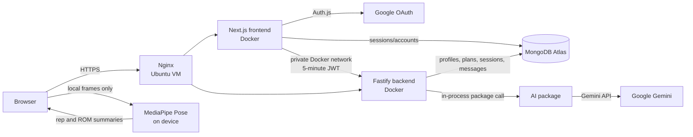

# forgefit.space architecture

## Runtime design

`frontend/` and `backend/` are separately deployable containers. Production
runs both on an Ubuntu VM behind Nginx and connects them through a private Docker
network, with Cloud Run retained as an alternative adapter. `ai/` and
`packages/contracts/` are private workspace packages bundled into their
consumers; neither exposes a public endpoint.

## Request flows

### Sign-in

1. The browser starts Google OAuth through Auth.js in the frontend.
2. Auth.js stores the account and database session in MongoDB.
3. Protected Next.js pages require that session before rendering.

### Authenticated API call

1. The browser calls the same-origin `/api/backend/...` frontend route.
2. The frontend checks the Auth.js session and signs a five-minute JWT.
3. The frontend proxy sends that token to the backend as `Authorization: Bearer ...`.
4. The backend verifies `HS256`, issuer, audience, expiry, subject, and email.
5. Every query derives `userId` from the verified token, never from request input.

The internal bearer token and backend URL never enter the browser bundle. This
also avoids cross-origin browser calls and keeps preview deployments simpler.

### AI coach message

1. The backend validates and persists the user's message.
2. The AI package checks urgent and pain language before any model call.
3. For normal coaching, the backend removes account identifiers and builds a
   bounded snapshot containing the training profile, active plan, exact next
   workout prescription, active-session progress, five recent completed
   sessions, and the latest dated self-reported readiness check-in.
4. The model must return the declared structured schema, including 1–5 facts it
   used from that supplied context. The backend renders those facts as an
   auditable "Personalized from your data" section.
5. The response contract forbids invented exercises or prescriptions and
   requires workout reviews to contain specific priorities, targets, reasons,
   and adjustment triggers. Deterministic checks bypass the model for dangerous
   dehydration, purging, extreme-heat, diuretic, or performance-enhancing drug
   protocols.
6. The backend persists the validated assistant message and returns it.

### Daily readiness check-in

1. The browser sends a strict current-local-date check-in through the
   authenticated same-origin proxy; user identity is always derived from the
   signed backend token.
2. MongoDB stores at most one check-in per user and date. The readiness band is
   deterministically calculated from sleep quality, energy, soreness, stress,
   and motivation; sleep hours, optional weight, and notes remain context rather
   than diagnostic inputs.
3. The dashboard returns only the serialized user-owned check-in. The score is
   labelled self-reported and is never presented as a medical assessment.

### Adaptive plan generation

1. The authenticated profile determines allowed duration, experience, goal,
   frequency, and equipment.
2. The backend filters a reviewed exercise catalog before sending it to the AI
   package, so unavailable exercises are excluded from the prompt.
3. The Gemini API returns a schema-constrained four-week plan draft.
4. Deterministic code rejects unknown exercises, duplicate days or movements,
   excessive workout duration or volume, and maximal-effort prescriptions.
5. A MongoDB transaction archives the previous plan and inserts the new version
   plus all scheduled workouts atomically.

### Exercise library

1. The backend bundles all 1,324 non-media exercise records imported from the
   MIT-licensed Exercises Dataset used by OpenGym.
2. Public, rate-limited `GET /v1/exercises` and `GET /v1/exercises/:id` routes
   provide search, equipment/body-part/target filters, pagination, English
   instructions, and source provenance without a database round trip.
3. Gym Visual thumbnails and GIFs are excluded because cloning the upstream
   repository does not grant ForgeFit a commercial media license.
4. The large reference library remains separate from the reviewed planning
   catalog. An exercise becomes eligible for AI plans only after ForgeFit adds
   safety guidance, equipment mapping, experience requirements, and a licensed
   or curated demonstration.

### Workout execution and adaptation

1. Starting a scheduled workout creates one user-owned execution session and
   marks the planned workout in progress in the same MongoDB transaction.
2. Set logs, pause/resume transitions, and safe catalog substitutions use an
   optimistic session version so concurrent tabs cannot silently overwrite data.
3. A partial unique index permits only one active or paused workout per user.
4. Finishing transactionally closes the session, completes the planned workout,
   and recalculates future per-exercise load guidance from completion and RPE.
5. The dashboard serializes typed session history and lifetime progress; the
   browser never supplies a user ID for any workout operation.

### Live movement tracking

1. The user selects a supported exercise and explicitly consents before the
   browser requests camera permission.
2. A pinned MediaPipe Tasks Vision model estimates pose landmarks locally at a
   throttled frame rate. Video frames and landmark arrays never enter an API
   request, application database, analytics event, or AI prompt.
3. Deterministic joint-angle state machines require at least 0.65 landmark
   confidence and a complete extension-to-flexion-to-extension cycle before
   producing a rep.
4. The browser batches only event IDs, exercise IDs, timestamps, rep numbers,
   duration, confidence, and range-of-motion degrees through the authenticated
   same-origin API proxy.
5. The backend strictly rejects unknown fields, events for another exercise,
   paused or closed sessions, invalid timestamps, and confidence below the
   supported threshold. A unique event ID makes retries idempotent.
6. Turning the camera off, pausing, closing, or leaving the workout immediately
   stops every media track and closes the local pose task. Manual set logging is
   always available and unsupported exercises never use guessed tracking rules.

The MediaPipe runtime and model are fetched from version-pinned Google/jsDelivr
assets. MediaPipe may process non-frame performance and usage metrics, so that
fact is included in the camera consent text. Self-hosting these assets remains
an option if the production privacy review requires a tighter dependency
boundary.

## MongoDB ownership

Auth.js owns its account/session collections. The backend owns `appUsers`,
`profiles`, `workoutPlans`, `plannedWorkouts`, `workoutSessions`,
`movementEvents`, `readinessCheckIns`, `coachThreads`, and `coachMessages`. Both apps use the same
Atlas database initially, but the backend is the only component allowed to read
or write fitness records.

Use separate Atlas database users in production:

- Frontend credential: Auth.js collections only.
- Backend credential: forgefit.space application collections only.

This can be tightened after Auth.js collection names are confirmed in the
deployed environment. Backups, point-in-time recovery, and an Atlas region near
the selected GCP region should be configured before storing real user data.

## GCP deployment

Cloud Build creates two images from the same repository and stores them in
Artifact Registry. The VM pulls both versioned images through its service
identity and materializes separate root-only environment files from Secret
Manager:

| Service | Source | Required runtime configuration |
| --- | --- | --- |
| `fitai-frontend-vm` | `frontend` | `MONGODB_URI`, `MONGODB_DB`, `AUTH_SECRET`, `AUTH_GOOGLE_ID`, `AUTH_GOOGLE_SECRET`, `AUTH_URL`, `API_JWT_SECRET`, `BACKEND_API_URL`, `AUTH_TRUST_HOST` |
| `fitai-backend-vm` | `backend` + `ai` | `MONGODB_URI`, `MONGODB_DB`, `API_JWT_SECRET`, `GEMINI_API_KEY`, `GEMINI_MODEL` |

`API_JWT_SECRET` must be identical in both services. On the VM,
`BACKEND_API_URL` uses the backend container's private Docker hostname; browsers
still call only the frontend's same-origin proxy. Add
`https://forgefit.space/api/auth/callback/google` to the Google OAuth client.
Both container ports bind only to host loopback and Nginx exposes them on ports
80/443. SSH is restricted to IAP. The VM does not scale to zero and accrues
compute and disk charges while running. The checked-in scripts under
`infra/gcp/` deploy this topology without placing secret values in commands or
source files.

The current Gemini free tier is intended for development and testing. Google
states that free-tier content may be used to improve its products, so do not
send real health or movement notes until the project moves to paid data
handling or another approved private provider and the user-facing privacy flow
is complete.

## Hosting portability

Cloud Run and the Compute Engine VM are infrastructure adapters. The
applications themselves use standard containers, configurable ports, HTTPS
service URLs, and environment variables. No product module imports a GCP SDK.
Provider-specific IAM, registry, secret names, and scaling configuration remain
under `infra/gcp/`, while `compose.yaml` verifies the same two-container contract
locally. Moving to another container platform therefore changes the deployment
adapter and secret mappings rather than frontend, backend, database, or AI
business logic.

## Recommended additions

Connect these only when their milestone needs them:

- **Sentry:** frontend/backend exceptions and performance traces. Redact auth
  tokens, coach messages, health notes, and AI payloads before sending data.
- **Upstash Redis:** distributed API rate limits and short-lived idempotency
  keys once traffic spans multiple serverless instances. The current in-memory
  limiter is adequate only as an initial guardrail.
- **Inngest or Trigger.dev:** durable background jobs for plan generation,
  retries, and scheduled weekly adaptations. Keep interactive coach replies on
  the synchronous path.
- **PostHog:** consent-aware product analytics using event names and coarse
  properties only; never capture camera frames, free-text health notes, or coach
  conversation content.
- **MediaPipe Tasks Vision:** integrated for consent-gated, on-device pose
  landmarks. Raw video and landmarks remain in the browser.

The first operational integration should be Sentry, followed by distributed
rate limiting. A job system becomes valuable when adaptive plan generation is
implemented; adding it now would create infrastructure without a workload.
