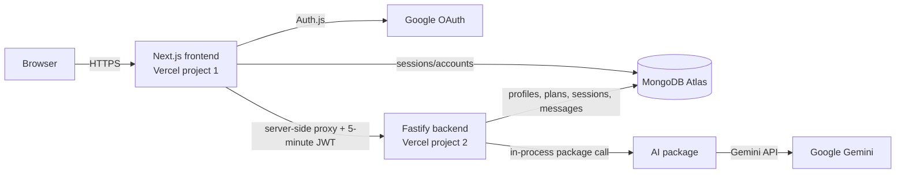

# FitAI Coach architecture

## Runtime design

`frontend/` and `backend/` are separate deployable roots. `ai/` and
`packages/contracts/` are private workspace packages bundled into their
consumers; neither exposes a public endpoint.

## Request flows

### Sign-in

1. The browser starts Google OAuth through Auth.js in the frontend.
2. Auth.js stores the account and database session in MongoDB.
3. Protected Next.js pages require that session before rendering.

### Authenticated API call

1. The browser calls the same-origin `/api/backend/...` frontend route.
2. The frontend checks the Auth.js session and signs a five-minute JWT.
3. The frontend proxy sends that token to the backend as `Authorization: Bearer ...`.
4. The backend verifies `HS256`, issuer, audience, expiry, subject, and email.
5. Every query derives `userId` from the verified token, never from request input.

The internal bearer token and backend URL never enter the browser bundle. This
also avoids cross-origin browser calls and keeps preview deployments simpler.

### AI coach message

1. The backend validates and persists the user's message.
2. The AI package checks urgent and pain language before any model call.
3. For normal coaching, it sends the profile and a bounded recent-history window
   to the Gemini API.
4. The model must return the declared structured schema.
5. The backend persists the validated assistant message and returns it.

### Adaptive plan generation

1. The authenticated profile determines allowed duration, experience, goal,
   frequency, and equipment.
2. The backend filters a reviewed exercise catalog before sending it to the AI
   package, so unavailable exercises are excluded from the prompt.
3. The Gemini API returns a schema-constrained four-week plan draft.
4. Deterministic code rejects unknown exercises, duplicate days or movements,
   excessive workout duration or volume, and maximal-effort prescriptions.
5. A MongoDB transaction archives the previous plan and inserts the new version
   plus all scheduled workouts atomically.

## MongoDB ownership

Auth.js owns its account/session collections. The backend owns `appUsers`,
`profiles`, `exercises`, `workoutPlans`, `plannedWorkouts`, `workoutSessions`,
and `coachMessages`. Both apps use the same Atlas database initially, but the
backend is the only component allowed to read or write fitness records.

Use separate Atlas database users in production:

- Frontend credential: Auth.js collections only.
- Backend credential: FitAI application collections only.

This can be tightened after Auth.js collection names are confirmed in the
deployed environment. Backups, point-in-time recovery, and an Atlas region near
the selected Vercel functions should be configured before storing real user data.

## Vercel deployment

Create two Vercel projects from the same Git repository:

| Project | Root directory | Required variables |
| --- | --- | --- |
| Frontend | `frontend` | `MONGODB_URI`, `MONGODB_DB`, `AUTH_SECRET`, `AUTH_GOOGLE_ID`, `AUTH_GOOGLE_SECRET`, `API_JWT_SECRET`, `BACKEND_API_URL` |
| Backend | `backend` | `MONGODB_URI`, `MONGODB_DB`, `API_JWT_SECRET`, `GEMINI_API_KEY`, `GEMINI_MODEL` |

`API_JWT_SECRET` must be identical in both projects. `BACKEND_API_URL` must be
the backend project URL or its custom API domain. Add
`https://<frontend-domain>/api/auth/callback/google` to the Google OAuth client.
In both Vercel projects, verify that **Include source files outside of the Root
Directory** is enabled because the apps import workspace packages from `ai/`
and `packages/`.

The current Gemini free tier is intended for development and testing. Google
states that free-tier content may be used to improve its products, so do not
send real health or movement notes until the project moves to paid data
handling or another approved private provider and the user-facing privacy flow
is complete.

## Recommended additions

Connect these only when their milestone needs them:

- **Sentry:** frontend/backend exceptions and performance traces. Redact auth
  tokens, coach messages, health notes, and AI payloads before sending data.
- **Upstash Redis:** distributed API rate limits and short-lived idempotency
  keys once traffic spans multiple serverless instances. The current in-memory
  limiter is adequate only as an initial guardrail.
- **Inngest or Trigger.dev:** durable background jobs for plan generation,
  retries, and scheduled weekly adaptations. Keep interactive coach replies on
  the synchronous path.
- **PostHog:** consent-aware product analytics using event names and coarse
  properties only; never capture camera frames, free-text health notes, or coach
  conversation content.
- **MediaPipe Tasks Vision:** on-device pose landmarks for the live-session
  milestone, keeping raw video in the browser.

The first operational integration should be Sentry, followed by distributed
rate limiting. A job system becomes valuable when adaptive plan generation is
implemented; adding it now would create infrastructure without a workload.
