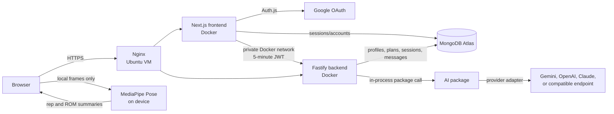

# forgefit.space architecture

The current deployed architecture is described below. The proposed scale and
migration design is tracked in [Architecture revamp plan](architecture-revamp.md).

## Runtime design


```mermaid
flowchart LR
  U[Browser] -->|HTTPS| N[Nginx<br/>Ubuntu VM]
  U -->|local frames only| P[MediaPipe Pose<br/>on device]
  P -->|rep and ROM summaries| U
  N --> F[Next.js frontend<br/>Docker]
  N --> B[Fastify backend<br/>Docker]
  F -->|Auth.js| G[Google OAuth]
  F -->|sessions/accounts| M[(MongoDB Atlas)]
  F -->|private Docker network<br/>5-minute JWT| B
  B -->|profiles, plans, sessions, messages| M
  B -->|in-process package call| A[AI package]
  A -->|provider adapter| O[Gemini, OpenAI, Claude,<br/>or compatible endpoint]
```

`frontend/` and `backend/` are separately deployable containers. Production
runs both on an Ubuntu VM behind Nginx and connects them through a private Docker
network, with Cloud Run retained as an alternative adapter. `ai/` and
`packages/contracts/` are private workspace packages bundled into their
consumers; neither exposes a public endpoint.

## Request flows

### Sign-in

1. The browser starts Google OAuth through Auth.js in the frontend.
2. Auth.js stores the account and database session in MongoDB.
3. Protected Next.js pages require that session before rendering.

### Authenticated API call

1. The browser calls the same-origin `/api/backend/...` frontend route.
2. The frontend checks the Auth.js session and signs a five-minute JWT.
3. The frontend proxy sends that token to the backend as `Authorization: Bearer ...`.
4. The backend verifies `HS256`, issuer, audience, expiry, subject, and email.
5. Every query derives `userId` from the verified token, never from request input.

The internal bearer token and backend URL never enter the browser bundle. This
also avoids cross-origin browser calls and keeps preview deployments simpler.

### AI coach message

1. The backend validates and persists the user's message.
2. The AI package checks urgent and pain language before any model call.
3. The backend resolves one encrypted, user-scoped provider configuration and
   passes it through a provider-neutral AI contract. Gemini, OpenAI Responses,
   Anthropic Messages, and configurable OpenAI-compatible endpoints are isolated
   behind adapters; route and domain code do not import provider SDKs.
4. For normal coaching, the backend removes account identifiers and builds a
   bounded snapshot containing the training profile, active plan, exact next
   workout prescription, active-session progress, five recent completed
   sessions, and the latest dated self-reported readiness check-in.
5. The model must return the declared structured schema, including 1–5 facts it
   used from that supplied context. The backend renders those facts as an
   auditable "Personalized from your data" section.
6. The response contract forbids invented exercises or prescriptions and
   requires workout reviews to contain specific priorities, targets, reasons,
   and adjustment triggers. Deterministic checks bypass the model for dangerous
   dehydration, purging, extreme-heat, diuretic, or performance-enhancing drug
   protocols.
7. The backend persists the validated assistant message and returns it.

When a member asks to generate a PDF, the selected model supplies the complete
document content through the same coach contract. A deterministic backend
renderer creates the branded PDF, stores it as a user- and thread-scoped coach
attachment, and returns the normal authenticated attachment URL. PDF output is
therefore independent of Gemini, OpenAI, Claude, or any OpenAI-compatible model.

Images and PDFs stay as provider-neutral file parts until the adapter boundary.
Each adapter translates the same bytes into its provider's native image or
document input. This same path powers text chat, live attachment review, camera
analysis, and plan generation.

### Daily readiness check-in

1. The browser sends a strict current-local-date check-in through the
   authenticated same-origin proxy; user identity is always derived from the
   signed backend token.
2. MongoDB stores at most one check-in per user and date. The readiness band is
   deterministically calculated from sleep quality, energy, soreness, stress,
   and motivation; sleep hours, optional weight, and notes remain context rather
   than diagnostic inputs.
3. The dashboard returns only the serialized user-owned check-in. The score is
   labelled self-reported and is never presented as a medical assessment.

### Adaptive plan generation

1. The authenticated profile determines allowed duration, experience, goal,
   frequency, and equipment.
2. The backend filters a reviewed exercise catalog before sending it to the AI
   package, so unavailable exercises are excluded from the prompt.
3. The configured AI provider returns a schema-constrained four-week plan draft.
4. Deterministic code rejects unknown exercises, duplicate days or movements,
   excessive workout duration or volume, and maximal-effort prescriptions.
5. A MongoDB transaction archives the previous plan and inserts the new version
   plus all scheduled workouts atomically.

### Exercise library

1. The backend bundles all 1,324 non-media exercise records imported from the
   MIT-licensed Exercises Dataset used by OpenGym.
2. Public, rate-limited `GET /v1/exercises` and `GET /v1/exercises/:id` routes
   provide search, equipment/body-part/target filters, pagination, English
   instructions, and source provenance without a database round trip.
3. Gym Visual thumbnails and GIFs are excluded because cloning the upstream
   repository does not grant ForgeFit a commercial media license.
4. The large reference library remains separate from the reviewed planning
   catalog. An exercise becomes eligible for AI plans only after ForgeFit adds
   safety guidance, equipment mapping, experience requirements, and a licensed
   or curated demonstration.
5. `GET /v1/exercise-demos` exposes paginated Workout Guide demonstration
   metadata and versioned object-storage URLs. React Query caches each result
   page for 24 hours, and the browser lazy-loads the referenced SVG/GIF media
   directly from Google Cloud Storage. RepDB records remain excluded from the
   backend API; their licensed assets stay separately attributed.

### Workout execution and adaptation

1. Starting a scheduled workout creates one user-owned execution session and
   marks the planned workout in progress in the same MongoDB transaction.
2. Set logs, pause/resume transitions, and safe catalog substitutions use an
   optimistic session version so concurrent tabs cannot silently overwrite data.
3. A partial unique index permits only one active or paused workout per user.
4. Finishing transactionally closes the session, completes the planned workout,
   and recalculates future per-exercise load guidance from completion and RPE.
5. The dashboard serializes typed session history and lifetime progress; the
   browser never supplies a user ID for any workout operation.

### Live movement tracking

1. The user selects a supported exercise and explicitly consents before the
   browser requests camera permission.
2. A pinned MediaPipe Tasks Vision model estimates pose landmarks locally at a
   throttled frame rate. Video frames and landmark arrays never enter an API
   request, application database, analytics event, or AI prompt.
3. Deterministic joint-angle state machines require at least 0.65 landmark
   confidence and a complete extension-to-flexion-to-extension cycle before
   producing a rep.
4. The browser batches only event IDs, exercise IDs, timestamps, rep numbers,
   duration, confidence, and range-of-motion degrees through the authenticated
   same-origin API proxy.
5. The backend strictly rejects unknown fields, events for another exercise,
   paused or closed sessions, invalid timestamps, and confidence below the
   supported threshold. A unique event ID makes retries idempotent.
6. Turning the camera off, pausing, closing, or leaving the workout immediately
   stops every media track and closes the local pose task. Manual set logging is
   always available and unsupported exercises never use guessed tracking rules.

The MediaPipe runtime and model are fetched from version-pinned Google/jsDelivr
assets. MediaPipe may process non-frame performance and usage metrics, so that
fact is included in the camera consent text. Self-hosting these assets remains
an option if the production privacy review requires a tighter dependency
boundary.

## MongoDB ownership

Auth.js owns its account/session collections. The backend owns `appUsers`,
`profiles`, `workoutPlans`, `plannedWorkouts`, `workoutSessions`,
`movementEvents`, `readinessCheckIns`, `coachThreads`, and `coachMessages`. Both apps use the same
Atlas database initially, but the backend is the only component allowed to read
or write fitness records.

Use separate Atlas database users in production:

- Frontend credential: Auth.js collections only.
- Backend credential: forgefit.space application collections only.

This can be tightened after Auth.js collection names are confirmed in the
deployed environment. Backups, point-in-time recovery, and an Atlas region near
the selected GCP region should be configured before storing real user data.

## GCP deployment

Cloud Build creates two images from the same repository and stores them in
Artifact Registry. The VM pulls both versioned images through its service
identity and materializes separate root-only environment files from Secret
Manager:

| Service | Source | Required runtime configuration |
| --- | --- | --- |
| `fitai-frontend-vm` | `frontend` | `MONGODB_URI`, `MONGODB_DB`, `AUTH_SECRET`, `AUTH_GOOGLE_ID`, `AUTH_GOOGLE_SECRET`, `AUTH_URL`, `API_JWT_SECRET`, `BACKEND_API_URL`, `AUTH_TRUST_HOST` |
| `fitai-backend-vm` | `backend` + `ai` | `MONGODB_URI`, `MONGODB_DB`, `API_JWT_SECRET`, `GEMINI_API_KEY`, `GEMINI_MODEL`, `USER_PROVIDER_CREDENTIALS_KEY` |

`API_JWT_SECRET` must be identical in both services. On the VM,
`BACKEND_API_URL` uses the backend container's private Docker hostname; browsers
still call only the frontend's same-origin proxy. Add
`https://forgefit.space/api/auth/callback/google` to the Google OAuth client.
Both container ports bind only to host loopback and Nginx exposes them on ports
80/443. SSH is restricted to IAP. The VM does not scale to zero and accrues
compute and disk charges while running. The checked-in scripts under
`infra/gcp/` deploy this topology without placing secret values in commands or
source files.

Provider data handling and retention terms vary. Do not send real health or
movement notes until the selected deployment and model have approved privacy,
retention, and regional-processing terms and the user-facing privacy flow is
complete.

## Hosting portability

Cloud Run and the Compute Engine VM are infrastructure adapters. The
applications themselves use standard containers, configurable ports, HTTPS
service URLs, and environment variables. No product module imports a GCP SDK.
Provider-specific IAM, registry, secret names, and scaling configuration remain
under `infra/gcp/`, while `compose.yaml` verifies the same two-container contract
locally. Moving to another container platform therefore changes the deployment
adapter and secret mappings rather than frontend, backend, database, or AI
business logic.

## Observability

Structured JSON lines from both containers, shipped to Cloud Logging by the Ops
Agent and queryable locally with the report script. Ingestion sits inside Google
Cloud's free monthly allowance at hobby volumes.

### One identifier across the tiers

The browser, the Next.js proxy, the Fastify backend, and each model call share a
single `x-request-id`.

1. The proxy adopts an inbound `x-request-id` or mints one, forwards it to the
   backend, and echoes it on the response.
2. The backend adopts the same header via `genReqId`, so pino stamps `reqId` on
   every line for that request, and echoes it back through an `onSend` hook.
3. Each model call records it on the run record described below.
4. `ApiRequestError.requestId` carries it into the browser, so a failure a member
   reports can be traced without guessing from timestamps.

Both tiers validate a supplied id against `^[A-Za-z0-9_-]{8,64}$` before adopting
it. An unconstrained header would let a caller inject newlines or unbounded text
into the log stream.

### AI run records

Every model call emits exactly one `ai.run` line, whether it succeeded or failed,
carrying token counts, wall-clock duration, USD cost, and the failure class. The
shape is `AiRunTelemetry` in `ai/src/telemetry.ts`, versioned by its `schema`
field so old lines stay parseable.

Run records carry no member content. Generated text already lives in
`coachMessages` and `workoutPlans`; duplicating it into logs would create a
second copy to delete on account removal. On a schema violation the record names
the *field* that broke the contract and its Zod issue code, never the value.

Summarize them with:

```bash
docker logs fitai-backend 2>&1 | npm run ai:report
npm run ai:report -- backend.log --since 2026-08-01
```

The report groups by feature and model and reports call volume, failure rate by
class, p50/p95 latency, token split, total cost, and cost per *successful*
response. That last column is the one that matters when comparing models: a model
that is cheap per call but fails validation often is not cheap.

### Cost attribution

`npm run ai:report` groups run records along any combination of `feature`,
`model`, `user`, `day`, `month`, and `outcome`:

```bash
docker logs fitai-backend 2>&1 | npm run ai:report                 # feature x model
npm run ai:report -- backend.log --by user --top 20                # heaviest members
npm run ai:report -- backend.log --by day,feature --since 2026-08-01
npm run ai:report -- backend.log --csv > spend.csv                 # opens in Excel
gcloud logging read 'jsonPayload.message="ai.run"' --format=json \
  | jq -c '.[]' | npm run ai:report -- --by user
```

`user` groups by `userRef`, the salted pseudonym on each run, so per-member spend
is attributable without the log store holding an account id or an email. Mapping
a `userRef` back to a person requires `LOG_SALT` and the account id together,
which is deliberate.

Two reporting decisions worth knowing when reading the numbers:

- **`cost/ok` is the column that matters** when comparing models. A model that is
  cheap per call but fails validation often is not cheap, because every failure
  still pays for tokens and then pays again on the retry or fallback.
- **An unpriced model reports `n/a`, never `$0`**, and is excluded from the total
  rather than silently counted as free. In CSV the cell is blank for the same
  reason: a spreadsheet `SUM` should not quietly treat unknown as zero.

Where this data lives, for now: nowhere but the logs. Cloud Logging is the
store and its retention is the retention; `--csv` is the export when a
spreadsheet is the right tool for a one-off question. That is deliberate for a
project with no users yet — a database table for run records would be a second
copy to keep, back up, and delete on account removal. The telemetry sink is
injected (`AiCallContext.onRun`), so adding a durable sink later is a change at
the call site, not in `ai/`.

### Failure classes

`AiProviderError.reason` distinguishes problems that have different owners:
`authentication`, `rate_limit`, `timeout`, and `unavailable` are the provider's;
`empty_response`, `malformed_json` (the model did not emit JSON), and
`schema_violation` (valid JSON that broke our contract) are ours. `retryable`
is derived from the class. User-facing messages are unchanged.

### What must never be logged

Coach message content, readiness notes, `movementNotes`, `bodyConsiderations`,
attachments, camera frames, and email addresses are health data. Logs record
shape — counts, lengths, durations, categories — and never content. `redactPaths`
in `backend/src/observability/logging.ts` enforces this for credentials and
payloads, and `backend/tests/logging-redaction.test.ts` asserts at runtime that
nothing leaks. Members appear as `userRef`, an HMAC of the account id keyed on a
server-only secret, so runs can be joined during debugging without the log store
becoming a personal-data store.

### Log levels

Both containers log through one instance — `backend/src/observability/logger.ts`
and `frontend/lib/logger.ts` — so every line in either has the same shape:

```json
{"severity":"INFO","level":"info","time":"2026-08-28T09:12:33.481Z","message":"ai.run","reqId":"...","ai":{...}}
```

`severity`, `time`, and `message` are the three fields Cloud Logging promotes out
of the payload. Everything else stays a structured `jsonPayload` field, so a
query can filter on `jsonPayload.ai.feature` or `jsonPayload.reqId` rather than
matching substrings in a blob.

`LOG_LEVEL` sets the floor, quietest to loudest: `fatal`, `error`, `warn`,
`info` (default), `debug`, `trace`. A line below the floor is never written, so
`debug` costs nothing until the level is lowered to admit it. On the VM, set
`FITAI_LOG_LEVEL=debug` and re-run the secret refresh to turn it on, then put it
back — debug lines are the bulk of any ingestion bill.

### Shipping logs to Cloud Logging

Both containers log with Docker's `journald` driver and a `tag`, so the systemd
journal holds every line with `CONTAINER_NAME` attached. The Ops Agent reads the
journal, parses our JSON out of the journal's `MESSAGE` field, and lifts
`severity` into the `LogEntry`. `docker logs fitai-backend` still works, so the
local `ai:report` workflow is unaffected.

`infra/gcp/vm/ops-agent-config.yaml` is installed by `deploy-backend.sh`, which
validates it before restarting the agent and warns rather than failing the deploy
if it is rejected. To validate a change by hand on the VM:

```bash
sudo /opt/google-cloud-ops-agent/libexec/google_cloud_ops_agent_engine \
  -in /etc/google-cloud-ops-agent/config.yaml -validate
```

Journald retention is capped in `startup.sh` at 512 MB and two weeks, so the
local buffer survives an agent outage without threatening the 20 GB disk.

Useful queries once logs are arriving:

```
jsonPayload.message="ai.run"                       # every model call
jsonPayload.ai.outcome="failed"                    # failures only
jsonPayload.ai.errorReason="schema_violation"      # our bugs, not the provider's
jsonPayload.reqId="<id from an error message>"     # one request, end to end
severity>=ERROR                                    # everything worth an alert
```

### Settings

| Variable | Default | Purpose |
| --- | --- | --- |
| `LOG_LEVEL` | `info` | pino level |
| `LOG_SALT` | `API_JWT_SECRET` | keys the `userRef` hash |
| `AI_LOG_FAILURE_EXCERPT` | `false` | records a bounded excerpt of output that failed to parse; raw output can echo member context, so enable it only while diagnosing |

The frontend container reads `LOG_LEVEL` only; it holds no secrets to redact.

Per-feature timeouts live beside each prompt in `ai/src/{coach,plan,vision}.ts`:
30s for coach, 120s for plan generation, 20s for a camera frame. There is no
retry yet — the failure classes above are what will make retry decidable.

## Recommended additions

Connect these only when their milestone needs them:

- **Sentry:** frontend/backend exceptions and performance traces. Redact auth
  tokens, coach messages, health notes, and AI payloads before sending data.
- **Upstash Redis:** distributed API rate limits and short-lived idempotency
  keys once traffic spans multiple serverless instances. The current in-memory
  limiter is adequate only as an initial guardrail.
- **Inngest or Trigger.dev:** durable background jobs for plan generation,
  retries, and scheduled weekly adaptations. Keep interactive coach replies on
  the synchronous path.
- **PostHog:** consent-aware product analytics using event names and coarse
  properties only; never capture camera frames, free-text health notes, or coach
  conversation content.
- **MediaPipe Tasks Vision:** integrated for consent-gated, on-device pose
  landmarks. Raw video and landmarks remain in the browser.

The first operational integration should be Sentry, followed by distributed
rate limiting. A job system becomes valuable when adaptive plan generation is
implemented; adding it now would create infrastructure without a workload.
