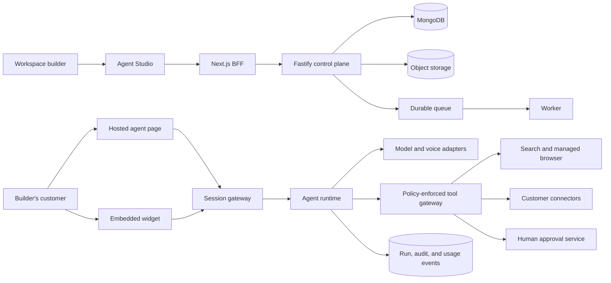
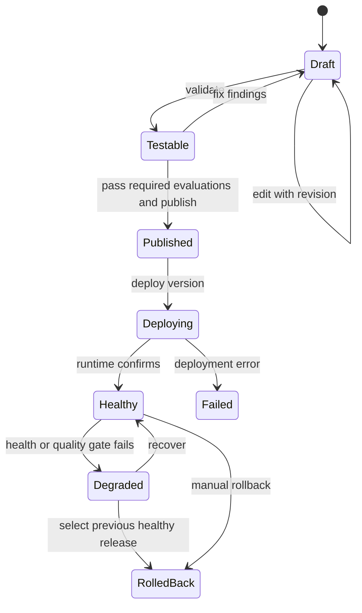
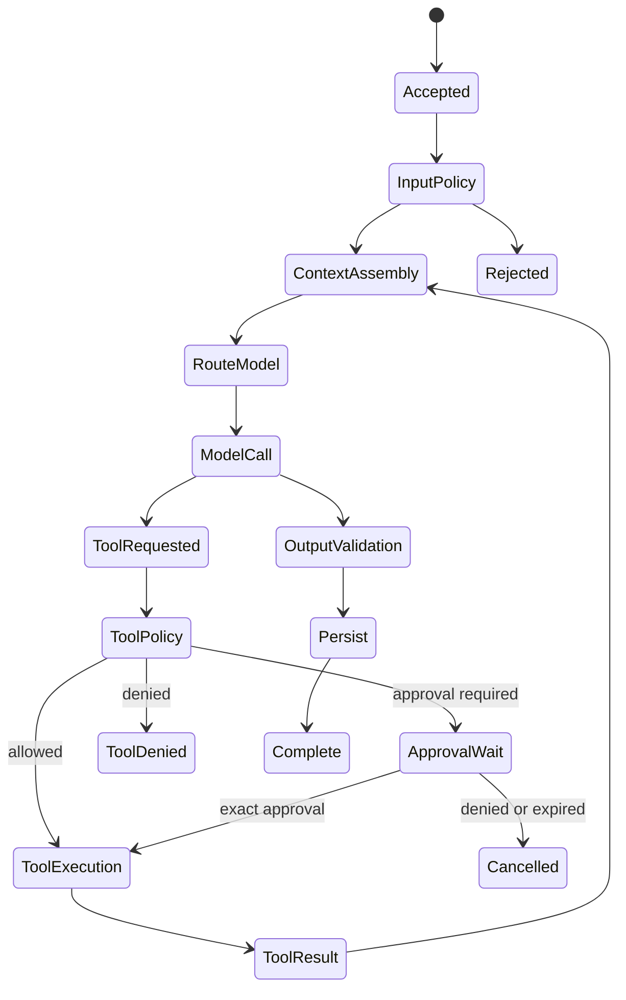

# General Agent Configurator Architecture

Status: proposed for discussion  
Date: 2026-09-07

## 1. Product decision

Build one domain-neutral agent configurator. A workspace builder describes and
configures an agent; the builder's customers use that agent through a hosted
page, an embedded widget, or an API.

`BrowseAssist` is the first reference configuration, not a hard-coded vertical.
The same platform must configure a shopping guide, insurance explainer,
appointment assistant, internal knowledge agent, or another bounded workflow
without adding domain names to core schemas.

Fitness and Career are parked legacy modules, not part of the target product.
Their source, APIs, and stored data are preserved for rollback, while server-side
flags keep their routes, navigation, and creation templates disabled by default.

### First reference configuration

BrowseAssist can:

- collect a customer's goal, budget, location, and constraints by voice or text;
- search allowlisted public sources and return cited product or policy facts;
- render comparable options as structured UI;
- open or guide an official web journey;
- prepare field values for review;
- pause for explicit human approval before entering sensitive data, accepting
  terms, applying, purchasing, paying, or submitting.

The initial release does not autonomously purchase, pay, bind insurance, accept
legal terms, or give regulated professional advice.

## 2. System context



## 3. High-level architecture

### 3.1 Control plane

The control plane owns configuration and governance:

- organizations, workspaces, members, and roles;
- agent identity and editable drafts;
- immutable published agent versions;
- tools, connections, secrets references, and policies;
- knowledge sources and versioned snapshots;
- environments, deployments, releases, and distribution surfaces;
- evaluation suites, audit events, and budgets.

The control plane never executes a consequential browser action directly from
an HTTP request. It validates commands, writes desired state, and delegates
durable work.

### 3.2 Data plane

The data plane serves deployed agents:

- issues short-lived end-user sessions;
- receives text, voice, and attachment turns;
- streams ordered runtime events;
- executes the deterministic run state machine;
- assembles permitted context;
- routes model calls through provider-neutral adapters;
- invokes tools through policy and approval gates;
- persists conversations, traces, citations, and exact usage.

### 3.3 Deployment units

Start as a modular monolith plus one worker, all in the existing monorepo:

| Unit | Responsibility |
| --- | --- |
| `frontend` | Agent Studio, test console, conversation review, BFF, hosted page |
| `backend` | Control-plane API, session gateway, auth, policy, transitional runtime |
| `worker` | Publishing, evaluations, indexing, browser jobs, deployment reconciliation |
| `packages/runtime` | Manifest compiler, run state machine, context/model/tool interfaces |
| `packages/contracts` | Versioned API, event, manifest, and SDK contracts |
| `ai` | Provider-specific model and voice adapters only |
| `packages/sdk-js` | Headless browser SDK for hosted and embedded deployments |

Split the session gateway or runtime into separate services only when measured
streaming load or provider isolation affects control-plane reliability.

## 4. Core domain model

Every tenant-owned record includes `organizationId` and `workspaceId`.
Authorization derives workspace access from the authenticated principal, never
from a client-provided owner ID.

### 4.1 Configuration entities

```ts
type Agent = {
  id: string;
  organizationId: string;
  workspaceId: string;
  name: string;
  description: string;
  tags: string[];
  lifecycle: "active" | "archived";
  createdBy: string;
  createdAt: string;
  updatedAt: string;
};

type AgentDraft = {
  id: string;
  agentId: string;
  revision: number;
  config: AgentDraftConfig;
  validation: ValidationFinding[];
  updatedBy: string;
  updatedAt: string;
};

type AgentDraftConfig = {
  identity: { displayName: string; purpose: string; audience: string };
  behavior: {
    instructions: string;
    tone: string;
    boundaries: string[];
    openingMessage: string;
    starterPrompts: string[];
  };
  channels: Array<"text" | "voice">;
  inputSchema?: JsonSchema;
  outputSchema?: JsonSchema;
  modelPolicyId: string;
  knowledgeSourceIds: string[];
  toolBindings: ToolBinding[];
  memoryPolicy: MemoryPolicy;
  retentionPolicyId: string;
  presentation: PresentationConfig;
};

type AgentVersion = {
  id: string;
  agentId: string;
  version: number;
  manifestSchemaVersion: number;
  manifest: AgentManifest;
  contentHash: string;
  publishedBy: string;
  publishedAt: string;
};
```

Drafts are mutable with optimistic concurrency. Versions are immutable. A
deployment pins an exact version and never points to a mutable draft.

### 4.2 Tool and approval entities

```ts
type ToolDefinition = {
  id: string;
  key: string;
  name: string;
  inputSchema: JsonSchema;
  outputSchema: JsonSchema;
  risk: "read" | "reversible_write" | "consequential_write" | "prohibited";
  idempotency: "none" | "supported" | "required";
  timeoutMs: number;
  requiredScopes: string[];
  dataClasses: DataClass[];
};

type ToolBinding = {
  toolDefinitionId: string;
  connectionId?: string;
  enabled: boolean;
  allowedOperations: string[];
  approvalPolicy: "never" | "policy" | "always";
  domainAllowlist?: string[];
  constraints: Record<string, unknown>;
};

type ApprovalRequest = {
  id: string;
  runId: string;
  stepId: string;
  actionDigest: string;
  toolKey: string;
  summary: string;
  destination: string;
  redactedArguments: Record<string, unknown>;
  sensitiveDataClasses: DataClass[];
  status: "pending" | "approved" | "denied" | "expired" | "consumed";
  expiresAt: string;
};
```

Approval is bound to the exact tool, arguments hash, destination, deployment,
and expiry. Editing any argument invalidates the approval. Approval can be
consumed once.

### 4.3 Runtime entities

- `Environment`: development, staging, or production boundary.
- `Deployment`: desired and observed state for one agent version.
- `Release`: immutable assignment of version, overlay, distribution surface,
  and rollout policy.
- `EndUserSession`: short-lived identity, deployment, channel, and allowed
  capabilities; contains no long-lived secret.
- `Conversation`: session/thread envelope pinned to agent version and release.
- `Message`: ordered typed content parts with provenance and idempotency key.
- `Run`: one user-turn execution with deadline, budgets, status, and model route.
- `RunStep`: model, retrieval, policy, tool, approval, or output-validation step.
- `BrowserSession`: isolated managed-browser lease tied to one run/conversation.
- `Artifact`: screenshots, extracted facts, attachments, and generated files in
  object storage; MongoDB stores metadata and ownership.
- `AuditEvent`: append-only actor/action/resource metadata with redaction.
- `UsageLedgerEntry`: provider-reported token, audio, tool, browser, and cost units.

## 5. Agent lifecycle



`Save draft`, `Test`, `Publish`, and `Deploy` are separate actions. A model may
propose configuration changes but cannot silently accept, publish, or deploy them.

## 6. Runtime execution LLD



Each transition writes a compact checkpoint. A run has:

- absolute deadline and cancellation token;
- maximum steps, tool calls, tokens, browser time, and monetary cost;
- stable client idempotency key;
- monotonic event sequence;
- retry policy that distinguishes read operations from side effects.

Side-effecting steps are never replayed implicitly. A retry first checks the
tool's idempotency record and the provider's result identifier.

### 6.1 Context precedence

1. Platform security rules.
2. Organization and workspace policy.
3. Immutable agent-version instructions.
4. Deployment/channel overlay.
5. Retrieved knowledge and permitted memory.
6. Compact conversation window and approved summary.
7. Current turn and attachments.
8. Tool/browser results explicitly labelled as untrusted evidence.

External pages, documents, and tool results are data, never instructions with
higher priority than the published manifest.

## 7. Browse and action tool architecture

The platform exposes generic tools. BrowseAssist selects and configures them.

### 7.1 MVP tool catalog

| Tool | Risk | Purpose |
| --- | --- | --- |
| `web.search` | read | Search approved public sources |
| `web.open` | read | Open a URL after scheme/domain validation |
| `web.extract` | read | Extract cited facts into a schema |
| `browser.navigate` | read | Navigate isolated managed browser |
| `browser.read_page` | read | Read visible semantic page state |
| `browser.prepare_form` | read | Produce a field/value review plan; does not type |
| `browser.fill_fields` | consequential_write | Enter approved fields; approval required when data is sensitive |
| `browser.submit` | consequential_write | Submit exact reviewed form; always requires fresh approval |
| `handoff.open_official` | reversible_write | Open verified official destination for user takeover |

Payments, passwords, OTPs, CAPTCHAs, acceptance of regulated terms, and binding
an insurance policy remain user-controlled in the first release.

### 7.2 Managed browser isolation

- one ephemeral browser context per end-user session or approved continuation;
- outbound network allowlist plus DNS/IP validation to prevent SSRF;
- no local filesystem, shell, extension installation, or arbitrary downloads;
- encrypted short-lived state, fixed idle/absolute timeout, and explicit close;
- screenshots/artifacts stored only when workspace policy permits;
- domain, action, and redacted argument recorded for every tool call;
- retrieved page content wrapped as untrusted evidence before model use;
- page mutations allowed only through typed gateway operations.

### 7.3 Commerce and insurance policy

The platform distinguishes:

- `research`: read-only facts and citations;
- `recommendation_support`: ranked trade-offs with disclosed criteria;
- `application_assist`: user-reviewed field preparation;
- `transaction`: submission, purchase, payment, or binding action.

Insurance comparisons must show source, effective/as-of date, premium basis,
eligibility assumptions, major coverage, exclusions, waiting periods, and what
remains unverified. The bot must not describe a policy as purchased or active
until the official provider confirms it.

## 8. API design

All mutating requests accept `Idempotency-Key`. List endpoints use cursor
pagination and tenant-scoped indexes. Errors follow one envelope:
`{ code, message, fieldErrors?, traceId, retryable }`.

### 8.1 Control-plane APIs

```text
POST   /v1/organizations
GET    /v1/workspaces
POST   /v1/workspaces
GET    /v1/workspaces/:workspaceId/agents
POST   /v1/workspaces/:workspaceId/agents
GET    /v1/agents/:agentId
GET    /v1/agents/:agentId/draft
PATCH  /v1/agents/:agentId/draft           If-Match: revision
POST   /v1/agents/:agentId/validate
POST   /v1/agents/:agentId/test-runs
POST   /v1/agents/:agentId/publish
GET    /v1/agents/:agentId/versions
GET    /v1/agents/:agentId/versions/:versionId/diff
POST   /v1/agents/:agentId/deployments
POST   /v1/deployments/:deploymentId/rollback
GET    /v1/tools
GET    /v1/connections
POST   /v1/connections
POST   /v1/connections/:connectionId/verify
GET    /v1/evaluation-suites
POST   /v1/evaluation-runs
GET    /v1/audit-events
```

### 8.2 Runtime APIs

```text
POST   /v1/runtime/session-tokens
POST   /v1/runtime/conversations
GET    /v1/runtime/conversations/:id/events
POST   /v1/runtime/conversations/:id/messages
POST   /v1/runtime/runs/:id/cancel
GET    /v1/runtime/approvals/:id
POST   /v1/runtime/approvals/:id/approve
POST   /v1/runtime/approvals/:id/deny
```

Streaming uses SSE first for ordered server-to-client events. WebSocket is used
for low-latency duplex voice. Both share the same event schema and cursor:

```ts
type RuntimeEvent = {
  runId: string;
  sequence: number;
  type:
    | "run.started"
    | "assistant.delta"
    | "citation.added"
    | "tool.requested"
    | "approval.required"
    | "tool.completed"
    | "run.completed"
    | "run.failed";
  payload: unknown;
  createdAt: string;
};
```

## 9. Frontend architecture

### 9.1 Route map

```text
/app/:workspaceId
├── /overview
├── /agents
│   ├── /new                 voice or typed intent -> proposal -> review
│   └── /:agentId
│       ├── /build           identity, behavior, knowledge, tools, channels
│       ├── /test            simulator, events, tool/approval preview
│       ├── /versions        immutable versions and diff
│       ├── /deployments     environments, release, rollback
│       └── /analytics       success, latency, quality, cost
├── /conversations
│   └── /:conversationId     transcript, trace, review
├── /evaluations
├── /usage
└── /settings
    ├── /members
    ├── /providers
    ├── /connections
    ├── /retention
    └── /audit

/a/:releaseSlug              hosted customer-facing agent
/embed/:releaseId            embeddable presentation surface
```

Legacy `/fitness`, `/career`, and `/exercises` routes remain outside this route
group and redirect to the main product while their server-side flags are off.

### 9.2 Component boundaries

- `WorkspaceShell`: workspace selector, role-aware navigation, global status.
- `AgentIntentComposer`: voice/text input and transcript correction.
- `AgentProposalReview`: confidence-labelled fields and explicit accept/edit.
- `AgentEditor`: section routing and optimistic draft revision.
- `IdentitySection`, `BehaviorSection`, `KnowledgeSection`, `ToolsSection`,
  `ChannelsSection`, `ModelPolicySection`, `SafetySection`.
- `ToolBindingEditor`: scopes, domains, risk, and approval requirement.
- `TestConsole`: user input, streamed answer, citations, and event timeline.
- `ApprovalPreview`: exact action/destination/data confirmation UI.
- `VersionDiff`, `DeploymentPanel`, `ConversationInbox`, `RunTrace`.
- `HostedAgentShell`: presentation only; no builder controls or secrets.

Server Components load identity, authorization, and initial read models. Client
Components own voice, form state, streaming, simulator state, and event handlers.

### 9.3 Draft editor state

Use server state as source of truth and a local reducer for unsaved edits:

```ts
type EditorState = {
  serverRevision: number;
  persisted: AgentDraftConfig;
  working: AgentDraftConfig;
  dirtyPaths: Set<string>;
  validation: ValidationFinding[];
  save: "idle" | "saving" | "saved" | "conflict" | "error";
};
```

Autosave may save a draft after a short debounce, but cannot publish or deploy.
On `409 revision_conflict`, show field-level server/local differences; never
silently overwrite another builder's changes.

### 9.4 Builder journey

```text
Describe agent by voice/text
  -> ask one highest-value missing question
  -> schema-constrained proposal
  -> review purpose, audience, boundaries, tools, data, approval policy
  -> save draft
  -> run test case
  -> inspect citations/tool requests/approval preview
  -> publish immutable version
  -> choose development deployment
  -> promote separately to production
```

## 10. Backend module LLD

```text
backend/src/domain/
  organizations.ts      workspace and membership invariants
  agents.ts             identity and draft commands
  manifests.ts          deterministic compile and content hashing
  publishing.ts         validation, evaluation gate, immutable version
  deployments.ts        desired/observed state and rollback
  conversations.ts      ordering, retention, review
  approvals.ts          exact action binding and one-time consumption
  policies.ts           authorization, tool, data, model, and budget policy
  audit.ts              append-only audit events

packages/runtime/src/
  engine.ts             deterministic run state machine
  context.ts            typed context assembly
  model-router.ts       provider/model policy and safe fallback
  tool-gateway.ts       schema, scope, risk, approval, idempotency
  events.ts             monotonic event stream
  manifest.ts           versioned runtime contract
```

Domain commands return events/results and do not depend on Fastify request
objects. Route handlers authenticate, validate transport input, call domain
commands, and map domain errors to the standard envelope.

### Required MongoDB indexes

- memberships: unique `(organizationId, principalType, principalId, workspaceId)`;
- agents: `(workspaceId, lifecycle, updatedAt, _id)`;
- drafts: unique `(workspaceId, agentId, id)` and `(agentId, revision)`;
- versions: unique `(agentId, version)` and unique `(agentId, contentHash)`;
- deployments: unique `(environmentId, agentId, targetId)`;
- conversations: `(workspaceId, deploymentId, updatedAt, _id)`;
- messages: unique `(conversationId, sequence)` and unique client idempotency key;
- runs: `(workspaceId, status, createdAt)`;
- run steps: unique `(runId, sequence)`;
- approvals: `(workspaceId, status, expiresAt)` and unique `actionDigest` per run;
- audit events and usage ledger: `(workspaceId, createdAt, _id)`.

## 11. Model, voice, and knowledge design

The model router chooses by required tool/structured-output support, latency,
quality tier, context size, workspace allowlist, data residency, provider health,
and remaining budget. Fallback is allowed only before a side effect and only to
a compatible route.

Voice uses a channel adapter that converts speech events into the same ordered
conversation/run events as text. Voice never changes tool or approval policy.
The transcript is editable before a consequential action is prepared.

Knowledge ingestion is asynchronous:

```text
upload/link -> validate -> malware/type check -> extract -> chunk -> embed
            -> build immutable snapshot -> attach snapshot to agent version
```

Retrieval filters by workspace, source ACL, snapshot, and retention policy before
semantic search. Every answer that relies on retrieved or web content retains
source IDs and citations.

## 12. Security and privacy

- Auth.js for human identity initially; workspace roles enforced in Fastify.
- Roles: owner, admin, builder, operator/reviewer, and read-only viewer.
- Secrets stored in a vault or envelope-encrypted store; DB holds references.
- Short-lived scoped runtime/session credentials; no server key in the browser.
- Tenant scope on every query and compound index.
- Schema validation on every tool argument and result.
- URL canonicalization, allowlist, redirect revalidation, private-IP blocking.
- Sensitive-data classification and redaction before unsupported providers.
- Prompt-injection tests for pages, documents, tool output, and citations.
- Content logging off by default; separate operational metadata from transcripts.
- Configurable retention plus verified deletion across DB, objects, cache, and logs.
- Append-only audit trail for publish, deployment, secret, approval, and tool actions.

## 13. Reliability and scale

### Initial SLO targets

- control-plane availability: 99.9%;
- runtime gateway availability: 99.95%, excluding provider outages;
- p95 first text event: under 2.5 seconds for non-browser turns;
- duplicate consequential side effects: zero accepted tolerance;
- published version immutability and tenant isolation: zero accepted tolerance.

### Failure behavior

- model timeout before side effect: retry compatible route within run budget;
- model timeout after side effect: do not retry action; inspect idempotency result;
- browser crash: checkpoint state and offer a reviewed restart, never claim success;
- approval expires: cancel pending action and regenerate review if inputs change;
- stream disconnect: reconnect with last received sequence cursor;
- queue redelivery: idempotent consumer checks command result;
- provider outage: degrade channel or model only when policy allows;
- stale web result: display source and as-of time; do not present as current fact;
- deployment failure: keep previous healthy release serving traffic.

Scale in stages: modular monolith, then durable worker/queue, then separate
runtime gateway, then regional data plane. Do not introduce microservices before
independent scaling or availability requirements are measured.

## 14. Observability and evaluations

Trace BFF request, API command, queue wait, run, model call, retrieval, tool call,
approval wait, browser operation, stream, and persistence with opaque IDs.
Never put raw user content or secrets in span names.

Each run records actual provider/model, token/audio/tool/browser units, latency,
cost, stop reason, citations, policy decisions, and redacted errors.

Evaluation layers:

1. deterministic schema, policy, citation, and tool-contract tests;
2. golden task cases for expected outcome and structured fields;
3. adversarial cases for prompt injection, unsafe URLs, and approval bypass;
4. provider comparison for quality, latency, and cost;
5. privacy-filtered human review samples;
6. production regression gates before promotion.

BrowseAssist MVP evals must cover product comparison correctness, source
freshness, insurance exclusion visibility, hallucinated price/link rejection,
sensitive-field approval, submit-button approval, cancellation, and duplicate
submission prevention.

## 15. Testing strategy

- unit: reducers, validators, manifest compiler, policies, idempotency, state machines;
- contract: API schemas, runtime events, SDK compatibility, provider adapters;
- integration: MongoDB indexes, tenant scoping, queues, object ownership;
- browser E2E: draft creation, conflict recovery, test console, approval review,
  hosted session, reconnect, responsive layouts, keyboard and screen reader flow;
- security: IDOR, cross-tenant search, SSRF, redirects, prompt injection, replay,
  credential isolation, sensitive logs;
- resilience: provider timeouts, browser crash, queue redelivery, cancellation,
  partial streaming, deployment rollback;
- load: session admission, streaming concurrency, queue depth, tenant fairness.

Parked legacy modules retain focused regression coverage so preserving their code
does not create silent breakage; the main release gate prioritizes the general
configurator and runtime suites.

## 16. Repository migration plan

No existing collection is renamed or destructively migrated in the first pass.

1. Add new contract modules and retain current package exports.
2. Add workspace/agent/version collections alongside legacy `bots`.
3. Put new Agent Studio routes behind a feature flag.
4. Import a legacy bot idempotently as Agent + Draft + imported Version only when
   needed; preserve `legacySourceId`.
5. Keep current Studio read/write path available during shadow comparison.
6. Add runtime interfaces around existing AI adapters before moving execution.
7. Switch new configurable agents to the new runtime; keep parked legacy paths
   disabled behind server-side rollback flags.
8. Remove compatibility code only after counts, tests, rollout, and rollback pass.

## 17. Delivery plan

### Phase 0 — decisions and contracts (week 1)

- approve builder persona, first deployment surface, tenant model, and MVP tools;
- write ADRs for tenancy, versioning, tool risk, approvals, runtime events;
- define contracts and migration fixtures; preserve the current test baseline.

### Phase 1 — usable configurator (weeks 2–4)

- organization/workspace and role middleware;
- Agent, Draft, immutable Version, validation, publish compiler;
- new workspace shell and general Agent Editor;
- voice/text intent-to-proposal with typed review;
- generic tool catalog and policy editor;
- test console using existing provider adapters.

Exit: a builder creates, edits, tests, and publishes a domain-neutral agent.

### Phase 2 — safe BrowseAssist runtime (weeks 5–7)

- web search/open/extract tools with citations;
- managed-browser read/navigation and isolated sessions;
- form preparation plus exact human approval objects;
- hosted agent page and short-lived customer sessions;
- conversations, run steps, SSE resume, audit, and exact usage.

Exit: a configured agent researches and compares options, guides an official
journey, and cannot fill or submit without the declared approval policy.

### Phase 3 — deployment and operations (weeks 8–10)

- development/production environments, releases, deployment reconciliation;
- conversation inbox, run trace, review labels, budgets, and incident states;
- evaluation suites and publish/promotion gates;
- web embed and initial JavaScript SDK.

Exit: an operator can explain a run, reproduce a failure, publish a fix, canary
it, and roll back without mutating the prior version.

### Phase 4 — hardening (weeks 11–12)

- security review, retention/deletion verification, provider portability;
- concurrency/admission control, load and soak tests, disaster recovery rehearsal;
- insurance-specific legal/compliance review before enabling a production
  insurance workflow.

## 18. First implementation slice

Implement this vertical foundation before browser automation:

1. `Agent`, `AgentDraft`, `AgentVersion`, and manifest contracts.
2. Draft create/read/update with optimistic revision.
3. Deterministic validator and immutable publish endpoint.
4. General editor with Identity, Behaviour, Tools, and Safety sections.
5. Test console with a read-only `web.search`/`web.open` adapter.
6. BrowseAssist sample configuration seeded as ordinary workspace data.
7. Tests proving no schema or runtime branch depends on `browse_assist`.

This delivers the general configurator. Form fill, submission, payments, and
insurance purchase remain later tool bindings behind approval and compliance.

## 19. Architecture acceptance criteria

- Core schemas contain no shopping, insurance, fitness, career, or BrowseAssist
  vertical enum.
- BrowseAssist is exportable/importable configuration data.
- Fitness and Career source and data remain intact but are absent from the active
  navigation, template catalog, and default route experience.
- A published agent version cannot be edited.
- No deployment points to a draft.
- Every tool call is typed, scoped, risk-classified, budgeted, and traced.
- Every consequential action requires an exact, fresh approval when policy says so.
- External content cannot modify system policy or tool permissions.
- Tenant-isolation negative tests cover every read and write path.
- A disconnected stream resumes without duplicate messages or actions.
- Operators can trace an answer and distinguish suggested from completed actions.

## 20. Decisions to confirm before implementation

1. First builder: internal ForgeFit team, client business admin, or both.
2. First customer surface: hosted page, website widget, or both.
3. MVP browser level: research only, guided navigation, or reviewed form fill.
4. Whether insurance is an MVP demo or held until a compliance partner is involved.
5. Initial provider policy and whether customers may bring their own keys.
6. Public platform name and whether ForgeFit remains the umbrella brand.
