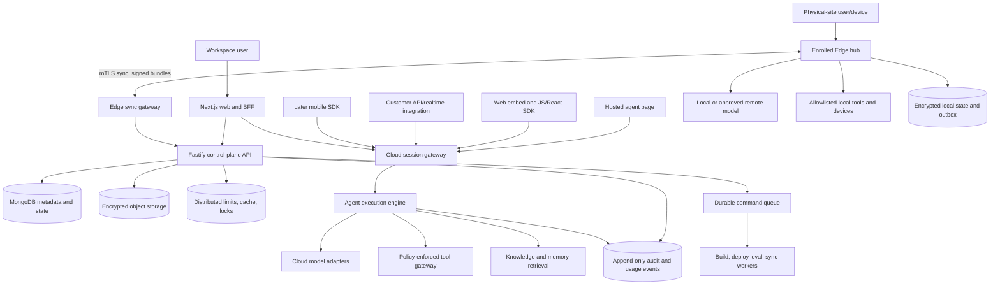

# Unified Agent Platform: Product, Architecture, and AI Design

Status: proposed

Branch: `feature/unified-agent-platform`

Date: 2026-09-06

Working product name: **Unified Agent Platform** (placeholder until naming is approved)

## 1. Executive decision

Pivot the repository into one B2B agent platform with a shared control plane and
two deployment runtimes:

- **Agent Studio** is the control plane for creating, testing, versioning,
  evaluating, deploying, and governing agents.
- **Cloud Runtime** runs web and mobile agent experiences with managed scaling,
  streaming, provider access, and centralized observability.
- **Edge Runtime** runs signed agent bundles on enrolled hubs or devices, keeps
  working through internet loss, and synchronizes allowed events when online.

The existing Next.js frontend, Fastify modular monolith, shared contracts,
provider-neutral structured-generation layer, Studio bot builder, voice paths,
and operational telemetry are foundations to evolve. The fitness, career, and
personal-specialist features must not be deleted. They become preserved legacy
applications and reference agent templates while the new control-plane model is
introduced alongside them.

The critical architectural change is to separate four concepts that are
currently combined in `BotDefinition` and its `draft | active` status:

1. mutable agent identity;
2. immutable published version;
3. environment-specific deployment;
4. runtime execution.

This separation must precede the B2B UI rewrite. Rebranding the existing bot
screen without it would hide, rather than solve, the Cloud/Edge deployment and
governance problem.

## 2. Repository evidence and present constraints

This design is based on the current branch and the pre-existing uncommitted work
that was present when this branch was created.

| Current evidence | What is reusable | Constraint for the pivot |
| --- | --- | --- |
| `frontend/` is Next.js 16 with Auth.js, React Query, and a same-origin backend proxy. | Existing authenticated web shell, BFF boundary, loading/error patterns, and responsive CSS. | Google OAuth maps directly to one user. There is no organization, workspace, membership, role, invitation, or service identity. |
| `backend/` is Fastify with route/domain modules and MongoDB indexes created at startup. | Keep a modular monolith for the first platform release; its route/domain split is sufficient. | Most records and indexes are keyed only by `userId`. Tenant isolation cannot be added only in the UI. |
| `packages/contracts/` already gives the frontend and backend a typed contract. | Evolve it into control-plane and runtime contracts without adding an extra network service. | It is one large file and its `BotDefinition` embeds draft state, configuration, and provider deployment identity. |
| `ai/src/provider.ts` supports Gemini, OpenAI Responses, Anthropic Messages, and configurable OpenAI-compatible endpoints with Zod structured output. | Preserve this provider-neutral seam and file-part normalization. | It supports one synchronous structured-generation operation; routing, streaming, tools, usage accounting, cancellation, and local Edge inference are not provider-neutral yet. |
| Provider settings resolve encrypted user credentials or platform credentials for AI and ElevenLabs. | Reuse credential encryption and provider-neutral selection concepts. | B2B needs multiple workspace-scoped connections, managed/BYO attribution, role-controlled rotation, model policy, health, and compatible failover. |
| Studio creates user-scoped bots, edits them, and activates them through ElevenLabs. Gemini Live is a browser fallback. | Reuse the form concepts: identity, context, behaviour, voice, tools, preview, and starter prompts. | `POST /v1/bots/:botId/activate` provisions a vendor agent directly and writes `providerAgentId` back to the mutable bot. This is not a versioned deployment system. |
| `botMessages` persists bot-scoped text/voice turns, including an idempotent `clientTurnId` path. | Preserve ownership checks, bounded history, attachment validation, and live-turn idempotency. | A bot has one flat message history rather than multiple conversations, participants, channels, run traces, reviews, or retention policies. |
| Attachments are validated and stored as MongoDB `Binary`. | Preserve validation and ownership rules during migration. | Large B2B artifacts belong in encrypted object storage; MongoDB should keep metadata only. |
| Operations uses request logs, message content length, provider configuration, and process stats. | Reuse dashboard presentation and request instrumentation. | Tokens are estimated as roughly characters/4; uptime and memory describe only the current process; there is no deployment, agent-version, Edge device, or exact provider-usage ledger. |
| Existing architecture documents already prefer a modular monolith, a later worker, object storage, distributed limits/idempotency, and redacted telemetry. | Those choices remain sound and reduce migration risk. | The current two-container deployment has no worker, durable command queue, control/data-plane separation, or device synchronization protocol. |
| Fitness camera processing keeps raw frames in the browser and sends only derived events. | This is a strong privacy pattern for Edge execution and data minimization. | Fitness-specific collections and prompts must remain isolated from generic agents. |
| The worktree contains an in-progress fitness/career product split and local-repository review path. | Preserve it; several elements can later become templates or tools. | The local repository path is a single server-side read-only root. It is not an Edge runtime or general customer connector. |

### 2.1 Current product scope

- Personal fitness coaching, readiness, plans, workouts, exercise content, and
  local camera-based movement tracking.
- Career readiness, role/application/interview data, and specialist sessions.
- A personal Studio for fitness, interview, resume, and custom bots.
- Text, document/image review, generated PDFs, grounded research, local
  repository review, Gemini Live, and ElevenLabs voice.
- Per-user provider settings and a per-user operations dashboard.

### 2.2 Immediate target scope

- Organization and workspace administration with explicit membership and RBAC.
- Agent Studio with drafts, immutable versions, test runs, evaluations, and
  controlled publishing.
- Cloud and Edge deployment targets, environment promotion, rollout state,
  configuration/secrets, health, and rollback.
- Hosted pages, web embeds, JavaScript/React SDKs, authenticated API/realtime
  integrations, developer documentation, and an Edge Hub installer/pairing flow;
  a native mobile SDK follows after the shared protocol stabilizes.
- A conversation inbox/review workspace with transcripts, run traces, feedback,
  filters, and privacy-aware retention.
- Usage budgets and exact cost/latency/quality reporting by organization,
  workspace, agent, version, deployment, provider, and model.
- Versioned plans, entitlements, trials, usage meters, managed credits, BYO
  provider attribution, and an explainable administrator upgrade journey.
- Multiple workspace-scoped provider connections with selectable models,
  routing/failover policy, encrypted credentials, and no required vendor lock-in.
- Auditable tool governance and human approval for consequential actions.

### 2.3 Deliberate non-goals for the first B2B release

- Do not split the Fastify API into many microservices.
- Do not promise arbitrary autonomous swarms; orchestration is explicit,
  bounded, observable, and budgeted.
- Do not require Cloud connectivity for an Edge agent's declared offline path.
- Do not make Edge a remote shell or allow arbitrary downloaded code.
- Do not remove or rewrite fitness/career data while establishing the platform.
- Do not build a full CRM, ticketing suite, or workforce-management system.

## 3. Product model and information architecture

The workspace should feel calm and operational: compact navigation, clear
status, progressive configuration, visible deployment history, and a review
queue centered on real conversations. Visual inspiration may inform clarity,
but terminology, layouts, interactions, illustrations, and branding must remain
original.

The visual system must be premium, restrained, and mature: muted neutral
surfaces, high-legibility typography, quiet borders, consistent spacing, and one
refined accent used to communicate hierarchy and state. Avoid neon, green-yellow
palettes, loud gradients, oversized decorative effects, and animation that does
not explain progress. Status color is semantic, never the main brand expression.
Dense operational data may use tables; creation flows use progressive disclosure
and plain language.

Primary navigation:

```text
Workspace switcher
├── Overview             health, recent activity, spend, incidents
├── Agents               list, create, templates
│   └── Agent
│       ├── Build        identity, instructions, models, tools, knowledge
│       ├── Test         simulator, traces, comparison, saved test cases
│       ├── Versions     immutable history and diff
│       ├── Deployments  Cloud/Edge targets, rollout, rollback
│       └── Analytics    quality, latency, usage, errors
├── Conversations        inbox, transcript, trace, review, feedback
├── Deployments          fleet-wide Cloud/Edge status
├── Evaluations          datasets, suites, runs, regressions
├── Usage                exact usage, budgets, forecasts
└── Settings             members, roles, providers, secrets, retention, audit
```

The default agent page should answer, in order: what is deployed, where it is
deployed, which version is receiving traffic, whether it is healthy, what
changed, and what action is safe next. A single persistent status vocabulary is
used across list, detail, and operations views.

### 3.1 Low-friction creation and onboarding

The primary first-run journey should take a user from an outcome in their own
words to a reviewable agent draft with minimal navigation:

```text
Create agent
  -> speak naturally or type a description
  -> onboarding agent asks only the single highest-value missing question
  -> structured draft proposal
  -> concise review/edit
  -> save draft
  -> optional test
  -> explicit publish and deployment choice
```

The onboarding agent extracts and proposes the agent name, purpose, audience,
tone, boundaries, knowledge needs, tools, channel, Cloud/Edge target, and starter
prompts. It returns a schema-constrained proposal with a confidence and source
turn for each inferred field. Low-confidence or consequential fields remain
visibly unresolved rather than being guessed. A user can correct any field in
the review screen or switch to a simple typed form at any time.

Voice is an input convenience, not a permission shortcut. The onboarding agent
must never auto-publish, deploy, connect a tool, upload private knowledge, or
enable recording. The review screen summarizes what the agent will do, what it
will not do, what data it needs, where it will run, and expected cost/privacy
implications. `Save draft`, `Test`, and `Publish` remain distinct explicit
actions. Returning users can use the same conversational edit flow on a draft,
with a structured before/after diff before accepting proposed changes.

Measure onboarding by time to reviewable draft, questions asked, field
corrections, draft completion, first successful test, publish conversion, and
post-publish rollback—not by raw clicks alone. Fewer clicks must not remove
meaningful consent, security, cost, or deployment decisions.

### 3.2 Agent Copilot and pre-publish Quality Review

Agent Studio includes an opt-in **Agent Copilot** that helps a builder decide
whether the proposed agent is the right solution, not merely fill configuration
fields. Given the user's stated outcome and current draft, it produces a typed,
reviewable plan containing:

- problem statement, intended users, and success criteria;
- recommended agent shape, channel, and Cloud/Edge deployment fit;
- assumptions and open questions;
- required knowledge, tools, permissions, and human handoffs;
- risks, cheaper/simpler alternatives, and an incremental test plan;
- recommended draft changes as an explicit diff the user may accept or reject.

The Copilot may offer current web research only with explicit permission for the
specific research task. Before the call, it shows the query purpose and warns
that generalized context will be sent to the configured provider. It excludes
private names, contact details, credentials, proprietary documents, and raw
conversation content from queries by default. Results include dates, source
links/citations, scope and uncertainty, and a reviewable summary. Research never
silently edits a draft, becomes trusted knowledge, or triggers a deployment.

Before publish, **Quality Review** evaluates goal clarity, bounded scope,
knowledge coverage/freshness, tool permissions, safety and guardrails, privacy,
deployment/runtime fit, expected cost, fallback behavior, and representative
test scenarios. Deterministic checks own hard blockers; model-assisted review
adds concise rationale, assumptions, and actionable improvements. The product
must never expose or claim to expose private chain-of-thought. It surfaces only
the structured decision, supporting evidence, and user-relevant explanation.
Warnings can be acknowledged according to policy; security, schema,
incompatible Edge capability, and required-evaluation failures block publish.

### 3.3 Customer deployment and distribution journey

Publishing creates an immutable version; distribution makes that version useful
inside a customer's product or physical site. Deployment is a guided core
journey, not a provider-specific button hidden inside the builder:

```text
quality-approved version
  -> choose environment: test / staging / production
  -> choose one or more distribution surfaces
  -> configure branding, domain/origin, authentication, and data policy
  -> create scoped deployment key or pair an Edge Hub
  -> verify with generated quickstart/checklist
  -> release to target with canary or full rollout
  -> monitor health, quality, usage, and cost
  -> promote, pause, or roll back to a prior healthy version
```

Core distribution surfaces:

| Surface | Customer value | Launch contract |
| --- | --- | --- |
| **Hosted agent page** | Fastest shareable web experience with no customer code. | Workspace branding, optional verified custom domain, access mode, consent/retention notice, environment banner outside production, and stable release URL. |
| **Web embed widget** | Drop-in chat/voice experience for an approved customer site. | Small loader, origin allowlist, theme tokens, signed end-user session handoff where authenticated, CSP guidance, lazy loading, accessibility, and versioned widget API. |
| **JavaScript SDK** | Framework-neutral control over session, messages, streaming events, tools/approvals, errors, and reconnect. | ESM package, TypeScript types, explicit environment/deployment ID, short-lived client token, abort/retry semantics, event cursor, and no long-lived secret in the browser. |
| **React SDK** | Idiomatic hooks/components on top of the JavaScript SDK. | Headless hooks first, optional accessible UI primitives, controlled styling, SSR-safe import, error/loading/offline states, and semver compatibility. |
| **Authenticated API and realtime integration** | Server-side or custom product integration. | Scoped server deployment key, short-lived end-user/session tokens, REST command/status APIs, SSE or WebSocket ordered events, idempotency keys, webhook signatures, quotas, and OpenAPI/event schemas. |
| **Mobile SDK** | Native mobile distribution after the web/API contract stabilizes. | Later capability using the same session/event contracts, secure device credential storage, mobile reconnect/background limits, and platform privacy declarations. |
| **Edge Hub installer** | Offline/local agent execution at a store, factory, office, clinic, or other physical site. | Signed installer/package, supported Linux matrix, preflight, one-time QR pairing, displayed device fingerprint, admin confirmation, mTLS enrollment, capability report, signed deployment bundle, and offline status semantics. |

Every surface references a `Deployment` and its current `Release`; no surface
points directly at a mutable draft. One deployment can expose multiple surfaces
when their policy is compatible. Promotion copies an approved version and
reviewed deployment overlay into the next environment; it does not rebuild the
agent from mutable state.

Deployment keys are environment- and deployment-scoped. Browser/mobile clients
receive only public identifiers or short-lived end-user tokens. Server keys are
shown once, stored hashed, support scopes, expiry, rotation, overlapping grace,
last-used metadata, rate limits, and immediate revocation. Production keys can
never call test/staging deployments or control-plane administration APIs.

Workspace branding includes display name, logo assets, neutral theme tokens,
legal/support links, email/support identity, and verified domains. Branding
cannot remove required provider/platform disclosures, consent, security, or
environment warnings. Custom-domain activation requires DNS ownership proof,
certificate status, conflict checks, and safe deprovisioning.

Developer documentation ships with the capability: generated quickstarts for
the selected deployment/surface, copyable environment-specific snippets,
OpenAPI and event schemas, SDK reference, auth/session patterns, CSP/CORS setup,
webhook verification, local test harness, rate/usage semantics, error catalog,
version migration guides, and runnable examples. Snippets use placeholders or
short-lived test tokens—never an actual server secret—and link back to the exact
deployment and environment they describe.

### 3.4 Public landing page journey and visual direction

The public home page is the first step of the product workflow, not a separate
marketing aesthetic. It must explain the shared Agent Studio plus Cloud/Edge
model quickly, show the concrete deployment surfaces, and lead an interested
buyer or builder into a reviewable first draft with minimal friction.

Recommended information architecture:

```text
Header
  Product | Cloud | Edge | Pricing | Developers | Security
  Sign in | Create an agent

Hero
  One control plane to design, test, and deploy agents anywhere
  Primary: Create an agent
  Secondary: Read the quickstart / View the product workflow

Workflow proof
  Describe by voice or text -> Quality Review -> Test -> Deploy

Agent Studio
  Versioned configuration, Copilot recommendations, evaluations, approvals

Deploy anywhere
  Hosted page | Embed | JS/React SDK | API/realtime | Edge Hub

Cloud and Edge comparison
  Managed reach and scale vs offline/local execution, with shared governance

Operations and trust
  Conversations, traces, usage/cost, rollback, privacy, provider choice/BYO

Plans preview
  Useful Developer tier, Team collaboration, Business/Edge, Enterprise controls

Developer proof
  Typed SDK/API example, environment selector, docs link

Final CTA
  Describe the agent you need | Talk to sales for enterprise/Edge

Footer
  Docs, status, security, privacy, terms, support
```

The hero should make one defensible promise and one product distinction. Avoid a
wall of feature badges, fake terminal noise, invented adoption numbers, customer
logos without permission, or generic claims such as “enterprise-grade” without
supporting controls. Product screenshots and diagrams should show actual states:
draft review, deployment target/version, conversation trace, and an Edge hub
offline/sync state. The Cloud/Edge comparison must explain tradeoffs rather than
implying every capability works identically everywhere.

Visual direction:

- warm or cool off-white and charcoal/graphite surfaces, quiet separators, soft
  elevation, and one refined accent such as deep indigo or muted blue;
- semantic green/amber/red only for status and never as the dominant brand
  palette; no green-yellow, neon glow, loud gradient field, or decorative grid
  competing with the product;
- clear typographic scale, compact navigation, generous reading width, short
  sections, and real interface crops with legible labels;
- restrained 150–220 ms transitions for navigation/state explanation, full
  `prefers-reduced-motion` behavior, and no scroll-jacking;
- responsive composition that keeps the value proposition and primary CTA above
  the fold on small screens, turns comparisons into readable stacked cards, and
  never hides pricing/deployment qualifications in hover interactions;
- WCAG-aware contrast, keyboard/focus behavior, semantic headings, meaningful
  alt text, optimized media, stable layout, and fast first render.

`Create an agent` takes a signed-out visitor through authentication and returns
them directly to the voice/typed onboarding start. A signed-in user goes straight
to their last workspace. `Developers` opens documentation without requiring an
account. `Talk to sales` is reserved for Enterprise/Edge/private-network needs
and must not block self-serve Developer or Team evaluation. Preserve form state
across sign-in where safe; never preserve a spoken recording without explicit
consent.

Instrument CTA choice, onboarding start, reviewable-draft completion, first
test, deployment-surface choice, successful release, docs-to-key creation, and
sales contact. Do not use session replay or capture voice/transcript/product
content by default. A/B tests may change copy/order, not hide pricing, consent,
provider mode, data policy, or publish controls.

## 4. Target logical architecture



### 4.1 Control plane and data plane

The **control plane** owns organizations, workspaces, agent definitions,
versions, evaluation policy, deployment intent, targets, secrets references,
memberships, audit events, and fleet state.

The **data plane** executes conversations and runs. Cloud execution uses a
session gateway and execution engine. Edge execution uses the same versioned
manifest contract but a local engine and local policy envelope. Separating the
planes allows Studio/API maintenance without breaking an already-installed
offline Edge agent.

Keep these as modules and separately deployable processes in the monorepo, not
independent repositories:

- `frontend`: control-plane UI, conversation review, authenticated BFF;
- `backend`: Fastify control-plane API and transitional synchronous Cloud path;
- `worker` (new workspace when durable work exists): builds, deployment
  reconciliation, evaluations, data lifecycle, and Edge synchronization;
- `runtime` (new shared package): manifest compiler, execution state machine,
  context builder, policy hooks, model/tool interfaces;
- `edge` (new deployable): local runtime, encrypted store, device connectors,
  bundle verifier, and sync client;
- `packages/contracts`: public/internal transport contracts and events;
- `ai`: provider adapters only, called through the runtime model interface.

## 5. Core domain model

Every tenant-owned record carries `organizationId` and `workspaceId`; identity
continues to come from verified authentication context. Route input may select a
workspace, but authorization must derive allowed workspaces from membership.

| Entity | Purpose and important invariants |
| --- | --- |
| `Organization` | Billing, legal/security boundary, default retention and regional policy. |
| `Workspace` | Operational partition inside an organization; environment and provider policy. |
| `Membership` | User/service principal + organization/workspace role. Unique per principal and scope. |
| `Agent` | Stable identity, name, description, owner, tags, lifecycle. Does not contain deployable mutable configuration. |
| `AgentDraft` | Mutable editor state with optimistic revision. One or more named drafts may exist later. |
| `AgentVersion` | Immutable compiled manifest, content hash, schema version, author, release notes, evaluation result. Never edited after publish. |
| `Environment` | Development, staging, production, or customer-defined promotion boundary. |
| `Deployment` | Desired and observed state for one agent version on one runtime target; supports rollout and rollback. |
| `Release` | Immutable environment-specific assignment of version + deployment overlay + rollout policy, with promotion provenance and rollback target. |
| `RuntimeTarget` | `cloud` region/pool or `edge` hub/group, including capabilities and policy compatibility. |
| `DistributionSurface` | Hosted page, embed, SDK/API, mobile, or Edge exposure bound to a deployment/release and access policy. |
| `DeploymentCredential` | Hashed, scoped, expiring, rotatable server key or short-lived client-session issuer; never a control-plane credential. |
| `WorkspaceBranding` | Versioned approved theme assets/tokens, legal/support links, and verified-domain bindings. |
| `EdgeDevice` | Enrolled hardware identity, certificate, software version, capabilities, last check-in, revocation state. |
| `Conversation` | Agent/version/deployment/channel/participant envelope with status, retention class, and timestamps. |
| `Message` | Ordered content parts with provenance, moderation result, token usage reference, and client idempotency key. |
| `Run` | One execution state machine including selected model route, context references, output, status, latency, and stop reason. |
| `RunStep` | Model call, tool call, delegated agent call, approval wait, retrieval, or policy decision. |
| `Review` | Human rating, labels, note, resolution, and reviewer; never rewrites the transcript. |
| `EvaluationSuite/Case/Run` | Versioned quality contract and reproducible result set. |
| `SecretReference` | Metadata only; secret bytes remain in a managed vault or Edge secure store. |
| `UsageLedgerEntry` | Provider-reported input, cached input, reasoning, output, audio, and tool units plus normalized cost. |
| `AuditEvent` | Append-only actor/action/resource/before-after metadata without sensitive message content. |

Use immutable IDs rather than slugs for relationships. Use monotonic per-stream
sequence numbers for messages, run steps, deployment events, and Edge sync. All
externally retried mutations require an idempotency key.

## 6. Migration without deleting existing product data

Introduce new collections and adapters; do not rename or mutate legacy
collections in place during the first release.

1. Create one personal organization/workspace for every existing user on first
   access or through a resumable backfill.
2. Project each legacy `bots` record into an `Agent`, an editable `AgentDraft`,
   and an immutable imported `AgentVersion`. Keep the original bot ID in
   `legacySource` for idempotent reruns.
3. Convert `providerAgentId` and `lastSyncedAt` into an imported Cloud voice
   deployment record; do not store provider identity on the agent version.
4. Import existing `botMessages` into an imported conversation per bot. Because
   the current schema has no conversation/thread identifier, do not invent
   precise sessions. Optionally segment by an explicit time-gap rule only after
   product approval and retain the original order/timestamps.
5. Copy attachment metadata first. Move bytes from MongoDB to object storage in
   a checksummed, resumable job, then retain a compatibility reader until the
   migration is verified.
6. Keep `/fitness`, `/career`, workout, coach, readiness, and exercise routes
   available behind a clearly labeled legacy/product-app entry. Their data
   remains in existing collections and can be selectively exposed as agent
   tools later through explicit adapters.
7. Run old and new reads in shadow comparison before switching navigation.
   Migration jobs write checkpoints, counts, hashes, and failure reasons.

Rollback means switching the read path and navigation flag back; it must not
require reversing destructive database changes.

## 7. Agent version and deployment lifecycle

```text
draft --validate--> testable --evaluate--> publish immutable version
                                           |
                                           v
deployment desired: queued -> deploying -> healthy
                                  |            |
                                  v            v
                               failed      degraded
                                               |
                              rollback <-------+
```

Publishing compiles a canonical `AgentManifest` with:

- identity and instruction layers;
- input/output schemas and supported channels;
- model routing policy and maximum budgets;
- tool contracts, risk classes, timeouts, and approval rules;
- knowledge snapshot references and retrieval policy;
- memory policy and retention class;
- child-agent references and orchestration limits;
- required runtime features and minimum runtime version;
- guardrail policy version;
- content hash and signature metadata.

The same manifest is channel-neutral and declares compatible presentation and
runtime capabilities. Web, mobile, Cloud, and Edge clients consume the same
published semantic version; deployment overlays select supported channel
features without forking the agent's core behavior.

The manifest contains secret references, never secret bytes. A deployment pins
an exact agent version, manifest hash, environment, target, configuration
overlay, rollout policy, and secret bindings. The reconciler compares desired
and observed state and produces an auditable deployment event stream.

A `Release` also pins the customer distribution surfaces, environment-scoped
credentials, branding/domain version, and compatibility requirements. Test,
staging, and production have separate releases and keys. Promotion creates a new
release record with provenance; rollback changes desired state to a previously
healthy release and preserves the failed release and incident evidence. Hosted,
embed, SDK/API, and Edge traffic all resolve through the same release identity,
so operational status and conversation traces remain comparable across channels.

## 8. Agent execution internals

Use one deterministic run state machine in Cloud and Edge:

```text
accepted -> policy_input -> assemble_context -> choose_route -> model
                                                     |          |
                                                     |          v
                                                     +------ tool_request
                                                                |
                                            denied/approval/execute/result
                                                                |
                                                                v
                                               validate_output -> persist -> complete
```

Each transition persists a compact checkpoint. A run has a deadline,
cancellation token, step limit, tool limit, token limit, cost limit, and stable
idempotency key. Retries resume from a safe checkpoint; they do not silently
repeat a side-effecting tool call.

### 8.1 Context assembly

Build context from typed layers in a fixed precedence order:

1. platform security and runtime rules;
2. organization/workspace policy;
3. immutable agent-version instructions;
4. deployment/channel overlay;
5. retrieved knowledge and permitted memory;
6. compact recent conversation window and rolling summary;
7. current user turn and attachments;
8. tool results, each labeled as untrusted evidence.

Store context references and hashes on the run, not a second uncontrolled copy
of every sensitive document. Record what sources influenced an answer, subject
to the workspace's privacy setting.

### 8.2 Model router

Replace direct route-level provider selection with a policy-driven router. The
router considers required capabilities, data residency, Edge availability,
latency class, quality tier, context size, tool/structured-output needs, tenant
allowlist, current health, and remaining budget.

Example routing tiers:

- **fast**: classification, extraction, short replies, summarization;
- **balanced**: normal agent turns and tool planning;
- **deep**: explicitly approved complex reasoning or high-value synthesis;
- **local**: offline/private Edge workload using an approved local endpoint;
- **fallback**: compatible provider/model that satisfies the same policy.

Fallback is allowed only before a side effect and only if residency,
capability, and policy remain satisfied. The UI and trace show the actual route.

### 8.3 Tool gateway

All tools implement a shared contract: typed input/output, risk class,
idempotency behavior, timeout, scopes, network/data policy, and audit redaction.
The gateway validates arguments, checks workspace/deployment permissions,
applies rate and concurrency limits, requests human approval when required,
executes with a short-lived credential, validates output, and records a trace.

Tool risk classes:

- `read`: no external mutation;
- `reversible_write`: mutation with a supported compensating action;
- `consequential_write`: message, payment, deletion, access change, or physical
  action requiring explicit policy and normally human approval;
- `prohibited`: unavailable in the declared runtime or tenant policy.

## 9. Multi-agent orchestration

Multi-agent behavior is an explicit graph, not an unbounded group chat. An
orchestrator version references pinned child-agent versions and declares:

- graph nodes and allowed transitions;
- input/output schemas for each delegation;
- data each child may receive;
- parallelism limit and deadline;
- per-child and total token/cost/tool budgets;
- maximum depth, steps, retries, and loop detection;
- merge strategy and final-answer owner;
- approval points and failure policy.

Recommended patterns are router, sequential pipeline, parallel fan-out with a
deterministic reducer, and planner/executor with a bounded plan. Child agents
receive task-specific context references rather than the entire parent prompt
and transcript. They cannot add children, tools, or budgets that the published
graph did not permit.

For durable work, the orchestrator writes commands to a queue and each step is
idempotent. The run remains visible while waiting, can be cancelled, and emits
heartbeats. Partial results are labeled; a failed child does not become a
fabricated success. Edge orchestration supports only graph features declared by
the local runtime capability document.

## 10. Cloud Runtime

The initial Cloud Runtime may execute inside Fastify to preserve velocity, but
it must call the shared runtime interfaces. Extract it when concurrent streams,
independent scaling, or release cadence justify a separate service.

Cloud responsibilities:

- serve hosted pages, embed/SDK sessions, and authenticated customer API/
  realtime integrations through one deployment/release resolver;
- exchange public deployment identifiers or scoped server keys for short-lived
  end-user/session tokens after origin, scope, environment, and quota checks;
- accept authenticated session/run commands;
- resolve deployment and pinned version;
- enforce per-workspace and per-deployment admission control;
- stream ordered events over SSE or WebSocket with resumable cursors;
- execute model/tool steps and persist checkpoints;
- isolate provider keys behind server-side secret references;
- publish exact usage, latency, policy, and error events;
- terminate or degrade predictably when budgets or dependencies fail.

The web embed and SDKs are clients of the runtime contract, not alternate
execution engines. They share ordered events, reconnect cursors, cancellation,
errors, approvals, and usage semantics. CORS/CSP/origin policy is scoped per
surface. Webhooks use per-endpoint signing secrets, timestamps, replay windows,
delivery IDs, retries, and an inspectable delivery log.

The existing direct browser-to-Gemini/ElevenLabs voice path can remain for a
legacy preview, but enterprise deployments need a runtime session record,
short-lived scoped tokens, explicit recording/retention policy, and server-side
event reconciliation. Provider session IDs never become the platform's primary
identity.

## 11. Edge Runtime

An Edge hub is an enrolled, least-privilege data-plane node. It downloads only
compatible signed bundles and policy, verifies the signature and manifest hash,
activates atomically, retains the previous healthy bundle, and runs from local
state when offline.

Minimum Edge components:

- signed installer/package and preflight for the supported Linux target;
- local pairing screen that displays a short-lived QR code, one-time code, and
  device fingerprint for an authenticated workspace admin to confirm;
- runtime supervisor and health watchdog;
- manifest verifier and atomic bundle store;
- local execution engine shared with Cloud;
- model adapter for approved local/OpenAI-compatible endpoints;
- allowlisted device/tool connectors;
- encrypted SQLite state, event log, and attachment cache;
- append-only outbox and cursor-based inbox;
- mTLS sync client with certificate rotation and revocation;
- resource monitor for memory, disk, temperature where available, and latency.

Offline contract:

- a deployment declares which model, tools, knowledge, and operations are
  available offline;
- unavailable Cloud-only features fail explicitly or queue only if policy says
  delayed execution is safe;
- completed local interactions receive stable IDs and monotonic sequence
  numbers before sync;
- sync uploads idempotent events in bounded batches and downloads commands after
  the acknowledged cursor;
- server-owned deployment intent wins; device-owned telemetry is append-only;
  conversation events merge by stream sequence rather than last-write-wins;
- secret material is device-bound where possible and can be remotely revoked;
- remote wipe is best-effort and must never be presented as guaranteed while a
  device is offline.

Start with one supported Linux hub, one local model adapter, text conversations,
read-only local tools, and delayed telemetry. Voice, accelerators, and
consequential device actions follow only after the reliability/security pilot.

## 12. Smooth runtime behavior and failure semantics

The UI and runtime share explicit states rather than using spinners as state:

- runs: queued, streaming, waiting-for-tool, waiting-for-approval, reconnecting,
  completed, cancelled, timed-out, failed;
- deployments: queued, deploying, healthy, degraded, failed, rolling-back,
  paused;
- devices: online, delayed, offline, updating, incompatible, revoked.

Rules for predictable behavior:

- acknowledge a user turn quickly with a run ID and ordered event cursor;
- stream partial output, but mark it provisional until output validation passes;
- reconnect with the last acknowledged cursor and deduplicate by event ID;
- use deadlines and capped exponential backoff with jitter;
- retry reads and explicitly idempotent commands only;
- apply bulkheads per provider, model, tool, workspace, and deployment;
- use circuit breakers to stop cascading provider failures;
- preserve the draft/input if a request fails;
- expose a concise user explanation and a deeper operator trace;
- load-shed lower-priority evaluation/background work before interactive runs;
- never silently switch from offline/local to Cloud when policy promises local
  processing.

## 13. Better output with fewer tokens

Token reduction is a product and architecture discipline, not prompt
compression alone.

1. **Compile stable instructions once.** Normalize repeated platform and agent
   policy into a versioned prompt artifact so providers with prefix caching can
   reuse it.
2. **Use task-specific context budgets.** Allocate a maximum to instructions,
   recent turns, summary, retrieval, tool results, and expected output before
   calling a model.
3. **Retrieve narrowly.** Hybrid retrieval filters by tenant, workspace, agent,
   version, permissions, document version, and metadata before selecting a
   small number of passages. Do not paste whole documents by default.
4. **Summarize incrementally.** Maintain a structured rolling conversation
   summary and durable facts with provenance. Re-summarize only the changed
   tail, and never discard unresolved commitments or corrections.
5. **Select the smallest capable model.** Route classification, extraction,
   moderation, and summaries to fast models; reserve deep models for measured
   quality gains.
6. **Use schemas and compact tool results.** Typed responses prevent verbose
   repair conversations. Tools return identifiers, essential fields, and
   references rather than raw dumps.
7. **Avoid redundant agent fan-out.** Delegate only when specialization or
   parallel evidence gathering has a measured benefit. Deduplicate shared
   retrieval across children.
8. **Bound generation.** Set task-specific output limits and stop conditions;
   prefer concise answer contracts in interactive channels.
9. **Cache deterministic work.** Cache retrieval embeddings, normalized
   document parsing, policy compilation, and safe tool reads by content hash and
   authorization scope. Never cache across tenants.
10. **Evaluate token efficiency.** Track quality score per 1K tokens, successful
    task cost, tool-call precision, and unnecessary context percentage.

The current character-based token estimate is useful only as a rough fallback.
Each provider adapter must return normalized usage with input, cached input,
reasoning where reported, output, audio, model, request ID, and provider. A
versioned price catalog converts usage to estimated cost while preserving the
provider invoice as the financial source of truth.

Budget enforcement occurs before and during a run at organization, workspace,
agent, deployment, user/API key, and orchestration-run levels. Thresholds can
alert, downgrade route, queue background work, or reject; they must never cause
an undeclared data-policy fallback.

## 14. B2B packaging and monetization

Packaging must make every substantial platform capability independently
entitleable and measurable without turning the product into a maze of paywalls.
The useful core loop—create a draft, test it, publish a small Cloud agent, inspect
recent runs, and understand usage—remains available at the entry tier. Higher
tiers monetize collaboration, scale, governance, retention, managed capacity,
advanced quality workflows, and Edge fleet operations.

### 14.1 Packaging principles

- Model plans as bundles of versioned entitlements, not plan-name checks in
  components or route handlers.
- Gate a capability at the backend policy boundary. The frontend consumes the
  same entitlement decision to explain availability and never acts as the only
  enforcement layer.
- Make limits and meters visible before use. Do not surprise users with an
  upgrade after they have completed a long configuration flow.
- Never hold customer data hostage. A downgrade keeps read/export/delete access
  and preserves published configuration; it may pause new writes, rollouts, or
  over-limit deployments according to a clear grace policy.
- Do not double-charge opaque units. Show the relationship between model usage,
  platform credits, runtime/device/storage units, and the invoice.
- Treat BYO-provider cost and platform fees separately. Customer-owned provider
  spend is not represented as platform-managed model spend.
- Give organization administrators budgets and controls; do not show billing
  prompts to end users who cannot upgrade.
- Make billing-provider APIs an adapter. Product authorization never depends on
  a synchronous payment-provider request.

### 14.2 Recommended tier model

Final prices require customer discovery and measured unit economics. Start with
the following capability structure:

| Tier | Intended customer | Included product value | Primary limits/paid expansion |
| --- | --- | --- | --- |
| **Developer** | Individual evaluating or building a first agent | One workspace, voice/typed onboarding, Agent Copilot, drafts, version history, test console, one small production Cloud deployment, hosted page, test embed/JS/API access, recent conversation review, basic evaluations, BYO provider, and a small managed-credit trial. | Low agent/deployment/member/concurrency/storage/retention quotas; platform subdomain/branding; no Edge fleet or enterprise identity. Must remain genuinely usable. |
| **Team** | Small product or operations team | Collaboration, test/staging/production, hosted page, production embed and JS/React SDK/API keys, workspace branding/custom domain, multiple deployments, managed credits or BYO providers, rollback, longer retention, shared review queues, scheduled evaluations, usage budgets, and standard support. | Seat bundle plus included usage; transparent overage or prepaid credit packs. |
| **Business** | Multi-team production operator | Advanced RBAC/approvals, generic OIDC, audit export, custom retention, multi-agent orchestration, higher concurrency, priority routing, Edge installer/pairing/fleet controls, and enhanced support. | Platform fee, seat band, usage, and Edge device packs; optional premium support and later mobile SDK. |
| **Enterprise** | Regulated or high-scale organization | SAML/SCIM, contractual SLOs, regional/data-residency controls, private networking, dedicated capacity, custom provider policy, customer-managed key option, legal hold, longer audit retention, and enterprise support. | Annual contract with committed usage/capacity and negotiated controls. |

Edge may be sold as a Business/Enterprise add-on priced by active device-month
or capacity band. Do not charge for a device merely being registered in an
inventory if it never activates; use an explicit `active_device_day` definition
and report it. Advanced multi-agent orchestration can be a capability add-on,
but simple single-agent tool use belongs in the core tiers.

### 14.3 Capability catalog and feature gates

Use stable entitlement keys with typed values. Example keys:

```text
workspace.max
member.max
agent.max
agent.publish
agent.version_retention
cloud.production_deployment.max
cloud.concurrent_run.max
surface.hosted_page
surface.web_embed
surface.javascript_sdk
surface.react_sdk
surface.api_realtime
surface.mobile_sdk
domain.custom.max
deployment_key.max
edge.enroll
edge.active_device.max
conversation.retention_days
conversation.review
evaluation.scheduled
evaluation.monthly_run.max
orchestration.enabled
orchestration.max_children
provider.byo
provider.managed_credits
security.advanced_rbac
security.oidc
security.saml_scim
audit.retention_days
support.tier
```

An entitlement value is boolean, integer, enum, or duration and carries source,
effective interval, and optional override. Enforcement returns a structured
decision: `allowed`, `allowed_with_warning`, `trial_available`, or `denied`, plus
limit, current usage, reset time, user-safe reason, and upgrade eligibility.
Hard gates cover unavailable capabilities and security policy. Soft limits warn
at configurable thresholds; metered limits may permit a declared overage or
stop new work. Already-running safe operations should finish unless the budget
policy or security incident requires termination.

### 14.4 Trials and upgrade journey

Recommend a 14-day Team trial without a card for qualified new workspaces, with
capped managed credits and abuse controls. A trial is a time-bounded entitlement
grant, not a mutated subscription plan. Show its end date, remaining managed
credits, which features will change, and the downgrade result from day one.

Upgrade entry points are contextual and sparse:

1. An administrator intentionally opens Plans & Billing.
2. Usage reaches warning thresholds such as 70%, 85%, and 100%.
3. An authorized builder selects a gated capability such as a second production
   deployment, Edge enrollment, SSO, or scheduled evaluations.
4. Forecasting predicts the current included usage will be exhausted soon.

The prompt explains the exact capability or limit, current usage, next-tier
allowance, recurring price and usage rate, billing interval, taxes where known,
proration, and effective date. `Compare plans`, `Start trial`, `Request admin`,
and `Upgrade` are explicit actions. Do not interrupt an end-user conversation
with billing UI; route the issue to the workspace admin and preserve the input.

Plan changes use a review screen and idempotent command. Upgrades can apply
immediately after confirmed billing state. Downgrades show affected members,
deployments, devices, retention, and automations; schedule at period end by
default. Payment failure starts a communicated grace period. Security controls,
data export/delete, and access to invoices/audit history remain available.

### 14.5 Billing and entitlement data model

| Entity | Purpose |
| --- | --- |
| `PlanCatalogVersion` | Immutable product plan, price, included quantities, and entitlement bundle effective for a time range. |
| `Subscription` | Organization, external billing reference, plan version, billing interval, status, currency, period, cancellation, and grace state. |
| `EntitlementDefinition` | Stable key, value type, enforcement semantics, and user-facing explanation. |
| `EntitlementGrant` | Plan, trial, contract, promotion, or support override applied to an organization/workspace for an effective interval. |
| `EntitlementSnapshot` | Resolved version/hash consumed by APIs and Edge leases; rebuildable from grants. |
| `MeterDefinition` | Stable unit, aggregation rule, dimensions, billability, reset cadence, lateness window, and deduplication contract. |
| `UsageEvent` | Immutable tenant-scoped event with source, quantity, dimensions, occurred/received times, and idempotency key. |
| `UsageAggregate` | Rebuildable period total for fast limit checks and billing previews. |
| `CreditWallet/LedgerEntry` | Managed-credit grant, reservation, debit, release, expiry, and adjustment; balance is derived from ledger entries. |
| `Trial` | Eligibility, entitlement grant, start/end, managed-credit cap, conversion, and abuse-review state. |
| `InvoiceProjection` | Explainable preview built from subscription, rates, aggregates, credits, tax assumptions, and billing-provider state. |
| `BillingEventInbox` | Idempotent record of signed billing-provider webhooks and processing status. |

Subscription and grants are the authorization source; the external billing
provider is the payment source. Signed webhooks enter an inbox, deduplicate by
provider event ID, and update subscription/grants transactionally with an
outbox. Cache resolved snapshots briefly and fail safely from the last valid
snapshot during billing-provider downtime. Support overrides require reason,
author, expiry, and audit event.

Recommended usage meters:

- provider-reported input, cached-input, reasoning, output, image, and audio
  units by model and credential mode;
- managed-credit debits and releases;
- successful/failed Cloud runs and billable runtime duration where applicable;
- active Cloud concurrency peaks;
- active Edge device-days and optional managed Edge compute units;
- object-storage GB-days and transfer if it materially affects cost;
- grounded research/tool executions with third-party cost;
- evaluation model usage and scheduled evaluation executions;
- active paid seats measured by an explicit monthly policy.

Conversation count alone is a poor primary billing unit because one conversation
can contain radically different work. Exact provider usage plus clearly defined
platform capacity units is more transparent. Every billable event stores the
plan/rate-card version used, while aggregates remain recomputable.

### 14.6 Plans, usage, and admin UX

`Settings -> Plans & Billing` should contain:

- current plan, renewal, trial/grace status, included quantities, and add-ons;
- current and forecast usage with warning thresholds and reset dates;
- breakdown by workspace, agent, deployment, model/provider, credential mode,
  Edge fleet, evaluation, and storage;
- managed-credit wallet and recent ledger activity;
- BYO-provider usage reported separately from platform-managed provider cost;
- budgets, overage behavior, alerts, and permitted purchasers;
- invoices/payment method through a secure billing-provider portal;
- plan comparison based on actual blocked/forecast needs rather than a generic
  feature wall;
- a pre-change impact preview and audit history.

Workspace settings show effective entitlements and limits but only organization
billing roles can purchase. Agent and deployment screens show a quiet inline
explanation when a relevant capability is unavailable. The API exposes an
`entitlements/evaluate` response suitable for both UI explanation and server
enforcement; it does not expose confidential contract terms to unauthorized
roles.

For offline Edge enforcement, issue a signed, short-lived entitlement lease with
an explicit offline grace interval. A temporary sync or billing outage must not
brick a deployed safety-relevant workload. After grace, apply the contract's
declared behavior—normally blocking new deployments/enrollments before stopping
existing local execution. Revocation for security compromise remains separate
and can take precedence when the device reconnects.

## 15. Multi-provider and BYO-provider architecture

Provider choice is an explicit workspace/deployment policy, not a platform-wide
environment variable and not a hard-coded vendor assumption. The existing
Gemini, OpenAI, Anthropic, and OpenAI-compatible structured-generation adapters
are the starting point. Extend the abstraction to cover capability discovery,
streaming, tool calls, embeddings where needed, live voice, normalized usage,
cancellation, health, and provider request IDs without reducing every provider
to its weakest feature set.

### 15.1 Provider domain model

| Entity | Purpose |
| --- | --- |
| `ProviderAdapter` | Code-level interface for capabilities, requests, streaming events, normalized errors/usage, and health probes. |
| `ProviderConnection` | Workspace-scoped configured vendor/endpoint, credential reference, mode, region policy, status, and last validation. |
| `CredentialReference` | Vault/KMS locator and key version; never contains plaintext in normal application reads. |
| `ModelCatalogEntry` | Stable internal model key mapped to provider model ID, capabilities, context/output bounds, regions, lifecycle, and price-card reference. |
| `RoutingPolicy` | Ordered rules for eligibility, quality/latency tier, budget, residency, fallback, and managed/BYO preference. |
| `ProviderHealth` | Region/model/connection availability, rate-limit/circuit state, and observation time. |
| `ProviderRateCardVersion` | Effective-dated managed-cost and normalized-unit mapping. |
| `ProviderUsageRecord` | Exact reported usage, platform estimate flags, credential mode, request/run IDs, and attribution dimensions. |

`ProviderConnection.mode` is `managed`, `customer_owned`, or `edge_local`.
Managed connections consume platform credits according to the applicable rate
card. Customer-owned connections send calls with the customer's encrypted
credential and attribute usage for budgets/analytics, but model charges go to
the customer-provider relationship. Edge-local connections have no assumed
external token price; they may be metered by runtime/device capacity.

### 15.2 Workspace configuration journey

An authorized admin can add multiple provider connections, validate credentials
without persisting a plaintext echo, inspect supported capabilities/models,
choose allowed models, set data/residency rules, and select managed, BYO, or
mixed routing. Agent builders choose a capability/quality tier or an allowed
model; deployment policy resolves the actual eligible connection. Advanced
users may pin an exact provider/model where reproducibility is more important
than failover.

The provider screen shows:

- connection name, mode, provider/endpoint, allowed region, capability status,
  key hint/version, validation time, and rotation action;
- approved model catalog with lifecycle/deprecation warnings;
- routing and fallback order with estimated cost/latency/quality class;
- exact managed usage/credits and separately attributed BYO usage;
- recent normalized errors and circuit state without secret/request content;
- which deployments would be affected by disable, rotation, or policy changes.

OpenAI-compatible endpoints use an explicit base URL allowlist, HTTPS
requirements in production, SSRF protection, DNS/IP revalidation, and capability
validation. Supporting a compatible protocol does not imply the endpoint meets
security, privacy, residency, reliability, or tool-calling requirements.

### 15.3 Routing and failover

At run start, the model router intersects agent requirements, deployment policy,
workspace allowlist, entitlement, data classification/residency, provider health,
context/output size, tool/streaming/schema capability, latency objective, and
remaining budget. It records the decision and concise rationale on the run.

Failover is opt-in by policy and limited to compatible approved routes. Never
fail over:

- to a provider or region outside workspace policy;
- from BYO to managed credits, or managed to BYO, unless the administrator
  explicitly allowed that direction and its cost behavior;
- from local Edge processing to Cloud when the deployment promises local-only;
- after a side-effecting tool may have executed unless the checkpoint proves
  replay safety;
- when the alternate model cannot honor required schemas, tools, context,
  safety policy, or channel.

Use health-aware weighted routing and circuit breakers, but avoid rapid model
flapping within a conversation. A deployment may pin the route for a session and
change only at a safe turn boundary. The user/operator trace displays the actual
provider, model, credential mode, fallback reason, and usage.

### 15.4 Credential security and privacy

- Encrypt customer credentials with per-environment envelope encryption and a
  managed KMS; store only ciphertext metadata/reference in MongoDB.
- Restrict create/rotate/delete/test to authorized workspace roles; never return
  plaintext after submission. Audit access and changes without logging values.
- Decrypt only inside the execution boundary just before a provider call, keep
  it out of prompt/tool context, and avoid long-lived process caches.
- Use short-lived federated/workload credentials where a provider supports them;
  prefer customer-controlled service identities over static API keys.
- Validate with a minimal non-sensitive request and disclose that validation may
  create provider-side usage.
- Redact authorization headers, signed URLs, provider payloads, and user content
  from default logs, support exports, billing events, and traces.
- Bind connections to workspace/organization scope and enforce this before
  secret resolution to prevent confused-deputy or cross-tenant access.
- Show provider-specific retention, training-use, residency, and subprocessor
  implications before enabling a connection. The platform must not overstate
  guarantees it cannot independently verify.

Portability tests run the same golden structured-output, streaming, tool, error,
usage, and cancellation contract against every adapter. Agent manifests use
internal capability/model policy keys rather than vendor SDK objects. Provider-
specific extensions live in optional namespaced configuration and cannot be
required for a supposedly portable agent without an explicit compatibility
warning.

## 16. Failure modes and edge cases

The launch plan treats degraded behavior as a designed product state. `MVP`
items block the corresponding capability's production launch. `Later` items are
hardening after measured demand. `Non-goal` boundaries must be stated in product
and operational documentation rather than implied away.

| Failure mode | Practical launch mitigation | Stage / boundary |
| --- | --- | --- |
| Agent gives a plausible but wrong, unsafe, or out-of-scope answer | Bounded instructions and context; structured output where appropriate; deterministic policy checks; citations/provenance for factual workflows; golden, adversarial, and regression evaluations; visible uncertainty; human approval before consequential action; conversation review and rollback to a pinned version. | **MVP.** Later: risk-based sampling and automated regression clustering. **Non-goal:** guaranteeing that probabilistic model output is always true. |
| Provider outage, latency incident, rate limit, quota exhaustion, or sudden cost spike | Timeouts, admission control, per-route circuit breakers, capped retries before side effects, explicit provider health, tenant budgets, exact usage alerts, approved compatible fallback, preserved user input, and clear degraded-state UI. | **MVP.** Later: committed capacity, multi-region pools, predictive budget anomaly detection. **Non-goal:** hiding every external outage or offering unbounded fallback spend. |
| Edge hub lacks RAM, disk, accelerator, model capacity, or thermal headroom | Device capability document, signed manifest minimums, pre-deploy compatibility check, disk reservation, local admission control, bounded context/model, health watchdog, atomic activation, and rollback to last healthy bundle. | **MVP for Edge.** Later: accelerator-aware scheduling and fleet capacity planning. **Non-goal:** supporting arbitrary hardware or silently moving local-only work to Cloud. |
| Local-network partition causes split-brain control or conflicting state | Cloud owns deployment intent and configuration; Edge holds a leased signed snapshot; device telemetry/conversation events are append-only; stable stream sequence, explicit version/hash, and deterministic conflict rules; reject concurrent mutable config writers. | **MVP for Edge.** Later: more granular reconciliation for approved collaborative state. **Non-goal:** generic multi-master configuration or arbitrary CRDT behavior. |
| Device pairing is intercepted, replayed, or performed by the wrong operator | Short-lived one-time pairing code, authenticated admin confirmation, displayed device fingerprint, nonce/challenge, mTLS device identity, least-privilege initial policy, certificate rotation, revocation, pairing audit, and rate limits. | **MVP for Edge.** Later: hardware-backed keys and attestation on supported devices. **Non-goal:** guaranteed remote wipe or immediate revocation while a device is offline. |
| Eventual sync delivers duplicates, gaps, or out-of-order events | Globally unique event and command IDs, per-stream monotonic sequence, cursor acknowledgements, idempotent inbox/outbox consumers, bounded replay window, gap detection, checksums, dead-letter state, and reconciliation metrics. | **MVP for Edge.** Later: log compaction and automated repair tools. **Non-goal:** claiming exactly-once network delivery; the contract is at-least-once plus idempotent effects. |
| Voice onboarding receives noisy, interrupted, accented, code-switched, or multilingual speech | Show live transcript, allow correction and typed fallback, retain a recoverable draft, ask one high-value clarification, attach confidence/source-turn to inferred fields, confirm names/URLs/numbers/deployment and permission choices, and never auto-publish. | **MVP.** Later: locale-specific testing, vocabulary hints, and acoustic/provider tuning. **Non-goal:** perfect transcription or inferring consequential consent from ambiguous speech. |
| PII or confidential data exceeds its allowed purpose/retention or leaks into logs/providers | Field/content classification, minimum required context, explicit provider/recording/sync policy, tenant ACL filters, redacted telemetry, encrypted stores, retention jobs, export/delete workflow, audit, and provider disclosure before use. | **MVP.** Later: legal hold, regionalization, advanced DLP, customer-managed keys. **Non-goal:** claiming zero retention, zero knowledge, or guaranteed provider deletion without contractual/technical evidence. |
| Knowledge becomes stale, revoked, contradictory, or loses provenance | Immutable knowledge snapshots per agent version, source/time metadata, permission checks at retrieval, freshness policy and warnings, checksum/version pinning, pre-publish Quality Review, and the ability to remove a source and publish a new version. | **MVP.** Later: scheduled connectors, change detection, re-index/evaluation triggers. **Non-goal:** guaranteeing external sources remain current without an active connector and freshness SLA. |
| Equivalent prompts drift across providers/models or after a provider model update | Capability contract, pinned model/version where available, model-specific adapter tests, shared golden evals, publish thresholds, route disclosure, safe turn-boundary failover, and canary comparison before changing a production routing policy. | **MVP.** Later: statistical calibration and automated shadow traffic with privacy controls. **Non-goal:** identical wording/behavior across probabilistic providers. |
| MCP or another tool returns prompt injection, requests excess scope, exfiltrates data, or performs an unintended action | Treat tool metadata/output as untrusted; admin-installed allowlist; typed schemas; tenant-scoped short-lived credentials; domain/network egress policy; output size/content limits; side-effect idempotency; exact-argument human approval; trace redaction; no prompt-to-shell path. | **MVP before third-party tools.** Later: stronger sandboxing, provenance/taint tracking, signed tool packages. **Non-goal:** arbitrary unaudited MCP servers, arbitrary code execution, or a general remote shell. |
| Billing/entitlement is bypassed, replayed, double-counted, or abused through trials/clients | Backend enforcement, signed/idempotent billing webhook inbox, immutable usage events with source idempotency keys, server/provider measurements, ledger-based credits, role checks, trial eligibility/rate limits, auditable overrides, and periodic invoice reconciliation. | **MVP before charging.** Later: anomaly/fraud scoring and contract-specific controls. **Non-goal:** trusting browser counters or blocking security/export/delete access over a payment dispute. |
| Onboarding becomes a long consultant interview or hides important decisions to reduce clicks | Start from outcome; voice or typed path; one highest-value question at a time; progressive disclosure; usable defaults; concise structured review; save before provider failure; surface cost/privacy/deployment implications; separate save, test, publish, and deploy. | **MVP.** Later: adaptive paths based on role/use case and measured abandonment. **Non-goal:** configuring every enterprise policy during first-run or auto-publishing for the user. |
| Managed credits are depleted while BYO credentials exist, or a BYO key expires mid-run | Reserve managed credits before a call; re-check hard budgets at step boundaries; validate connection health; preserve run checkpoint; use cross-mode failover only when the admin explicitly allowed it and show attribution. | **MVP.** Later: forecast-based replenishment and procurement workflows. **Non-goal:** silently spending from another credential mode. |
| A downgrade or payment failure would strand data, brick Edge, or leave unsafe deployments | Impact preview, period-end downgrade by default, grace state, read/export/delete continuity, block new deployments before existing safe execution, signed Edge entitlement lease with offline grace, and separate security revocation. | **MVP before charging.** Later: contract-specific remediation workflows. **Non-goal:** indefinite unpaid managed compute or guaranteed delivery of account changes to an offline device. |

## 17. Guardrails and quality controls

Use defense in depth:

### 17.1 Build-time

- validate manifests, schemas, tool scopes, model compatibility, data policy,
  Edge capability requirements, and orchestration graph bounds;
- run required evaluation suites and regression thresholds before publish;
- scan knowledge and configuration for secrets and unsupported file types;
- require review for policy-sensitive production changes.

### 17.2 Input and context

- validate size/type/signature, malware-scan stored files, and normalize text;
- classify policy/risk and redact configured sensitive data before external
  providers;
- treat documents, retrieved pages, tool output, and other agents' output as
  untrusted content, never as higher-priority instructions;
- enforce tenant and document ACL filters before retrieval.

### 17.3 Execution and tools

- apply step, time, token, cost, and concurrency limits;
- validate every tool argument and result against a schema;
- issue short-lived least-privilege credentials;
- require approvals for consequential actions and bind approval to the exact
  arguments and expiry;
- protect against SSRF, unsafe URLs, path traversal, prompt-to-shell execution,
  data exfiltration, replay, and confused-deputy access.

### 17.4 Output

- validate structured output and citations/provenance where required;
- run domain policy checks before committing side effects;
- distinguish generated suggestions from confirmed actions;
- preserve safe deterministic fallbacks for safety-critical legacy fitness
  rules;
- record policy decisions without logging secret or sensitive content.

## 18. Security and privacy architecture

### Identity and authorization

- Retain Auth.js initially, add organization/workspace membership, and support
  enterprise OIDC/SAML later behind an identity-provider interface.
- Use explicit roles such as organization owner, workspace admin, developer,
  operator/reviewer, billing viewer, and read-only viewer.
- Service/API identities use scoped, hashed credentials with expiry and rotation;
  device identities use certificates. Human session tokens are not device keys.
- Every database operation includes tenant scope and every sensitive action
  performs authorization in the backend, not only in Next.js.

### Secrets and cryptography

- Store Cloud secrets in a managed vault and persist references only.
- Envelope-encrypt customer credentials with versioned keys and auditable
  rotation; never return plaintext after creation.
- Encrypt transport, database/object storage, backups, and Edge local state.
- Sign Edge manifests/bundles with an offline-root/online-intermediate strategy;
  support key rotation and a denylist.

### Privacy

- Classify data fields and content; default to data minimization.
- Make provider, region, retention, transcript recording, training-use, and
  Edge-to-Cloud synchronization visible workspace policies.
- Separate operational metadata from message content. Redact telemetry and keep
  prompt/content logging off by default.
- Provide retention jobs, legal holds where required, exports, and verified
  deletion across MongoDB, object storage, search indexes, caches, backups, and
  Edge tombstones.
- Keep existing raw fitness camera frames on-device. Apply the same principle to
  new Edge sensors.
- Document subprocessors and provider retention. Do not claim zero retention or
  regional processing unless the configured provider contract guarantees it.

### Threats requiring explicit tests

- cross-tenant object reference and search leakage;
- malicious knowledge documents and indirect prompt injection;
- tool argument injection and credential exfiltration;
- forged/replayed Edge sync events or rollback to a vulnerable bundle;
- stolen device, copied local database, expired certificate, clock skew;
- webhook replay and duplicate side effects;
- sensitive content in errors, traces, analytics, or evaluation datasets;
- privilege escalation through agent deployment or approval workflows.

## 19. Observability, conversations, and evaluations

Instrument traces around BFF request, API command, queue wait, run, context
assembly, retrieval, model call, tool call, child run, policy decision, stream,
and persistence. Correlate by opaque trace/run IDs; do not put user content in
span names or default attributes.

Conversation review should show:

- transcript and channel timeline;
- pinned agent version and deployment;
- latency to first token and completion;
- model/tool/child-agent steps with sensitive arguments redacted;
- citations and retrieved source references;
- tokens, estimated cost, stop reason, errors, and policy decisions;
- reviewer score, labels, note, assignment, and resolution;
- consent/retention class and export/deletion state.

Quality cannot be inferred from usage. Add offline golden cases, policy/adversary
cases, tool-contract tests, retrieval relevance, model/provider comparison, and
human review sampling. Production signals create candidate eval cases only
after privacy filtering and explicit policy. Publishing to production can
require thresholds for task success, safety, schema validity, latency, and cost.

## 20. Scaling path and capacity gates

Initial design assumptions—validation targets, not promises:

- 10,000 organizations and 25,000 workspaces;
- 100,000 agents and 250,000 deployments;
- 20,000 concurrent Cloud sessions;
- 10,000 enrolled Edge hubs, including 25% temporarily offline;
- 2,000 interactive run starts/second at peak;
- at-least-once commands/events with idempotent consumers;
- 99.9% control-plane availability and 99.95% Cloud session-gateway
  availability, measured separately from third-party model availability.

| Stage | Architecture | Gate to advance |
| --- | --- | --- |
| 0. Modular-monolith foundation | Next.js + Fastify + MongoDB; new tenancy/version/deployment modules; synchronous Cloud runs behind interfaces. | Tenant-isolation tests, immutable publish, idempotent deploy, exact usage capture. |
| 1. Durable operations | Add object storage, distributed rate/idempotency store, command queue, and worker process. | Jobs exceed interactive deadlines, retries matter, or more than one API instance serves writes. |
| 2. Cloud data plane | Extract session gateway/execution workers; autoscale by active streams and queue depth. | Streaming concurrency or provider isolation impacts control-plane latency/releases. |
| 3. Edge pilot | Signed bundles, one Linux hub, encrypted local store, mTLS sync, offline text runs. | Successful disconnect/reconnect, revocation, power-loss, rollback, and data-loss testing. |
| 4. Regional scale | Region-aware gateways/workers, partitioned event/usage pipeline, read models, disaster recovery. | Measured latency/residency demand and recovery objectives justify operational cost. |

MongoDB remains the transactional metadata store initially. Use compound tenant
indexes and bounded queries. Move binary content to object storage and high-
volume append-only telemetry to a dedicated event/analytics store when measured
volume requires it. A cache is not a source of truth. Extract services only for
independent scaling, availability, ownership, or release cadence.

## 21. Implementation roadmap

### Phase 0 — protect and specify

- Keep this work on `feature/unified-agent-platform`.
- Approve product name, B2B tenant model, Edge hardware/OS, first customer use
  case, provider/data-residency policy, and legacy product placement.
- Validate tier packaging, managed-credit economics, BYO policy, trial limits,
  initial billing provider/currencies/tax ownership, and downgrade/grace behavior
  with prospective customers and finance/legal stakeholders.
- Add ADRs for tenancy, version/deployment split, Cloud runtime, Edge protocol,
  usage ledger, entitlements/billing, and provider routing/credentials.
- Capture current tests and migration fixtures before changing schemas.

### Phase 1 — platform foundation

- Split shared contracts into domain modules while preserving package exports.
- Add organization, workspace, membership, role middleware, invitations, and
  workspace switcher.
- Add the entitlement catalog/evaluator and resolved snapshot API before gated
  product UI. Seed Developer and internal test-plan grants without connecting
  production payments yet.
- Add `Agent`, optimistic `AgentDraft`, immutable `AgentVersion`, publish
  compiler, audit events, and compatibility projection from legacy bots.
- Build the new application shell and Agents list/detail using feature flags;
  leave fitness/career routes reachable.
- Replace the public ForgeFit landing experience behind a reviewable feature
  flag with the unified Agent Studio + Cloud/Edge story, restrained design
  system, pricing/developer entry points, and direct authenticated handoff into
  voice/typed agent onboarding. Do not finalize public naming before approval.
- Add the schema-constrained voice/typed onboarding proposal and concise review
  flow. It may save a draft after confirmation, but it cannot publish or deploy.
- Add the opt-in Agent Copilot plan/recommendation contract and deterministic
  publish-readiness checks. Adapt the existing grounded-research path for
  permissioned, cited research without automatically changing the draft.

Exit: two users in one workspace can collaborate according to role, cross-
tenant tests fail closed, and a published version is immutable and diffable.
The same exit also requires that a first-time user can create a reviewable draft
through voice or typing without losing work when voice/provider access fails,
every gated action returns one consistent explainable entitlement decision, and
the public primary CTA reaches that onboarding flow across sign-in without a
dead end or misleading capability claim.

### Phase 2 — Cloud deployment and runtime

- Add environments, Cloud targets, deployments, desired/observed reconciliation,
  rollout events, rollback, and secret references.
- Add releases, hosted agent pages, workspace branding/custom-domain
  verification, web embed, JavaScript/React SDKs, scoped deployment keys,
  short-lived client sessions, authenticated REST/realtime APIs, webhooks, and
  generated customer developer documentation. Defer native mobile SDKs until
  these session/event contracts stabilize.
- Move current text generation behind the shared execution engine and model
  router; preserve current provider adapters.
- Add multiple workspace provider connections, vault-backed BYO credentials,
  managed/BYO/Edge-local modes, model catalog, routing policy, safe failover,
  credential rotation, and provider portability tests.
- Introduce conversations, runs, steps, resumable streaming, exact usage ledger,
  and budget enforcement.
- Add meter definitions, immutable usage events/aggregates, managed-credit
  reservations/ledger, signed billing webhook inbox, trials, subscription/grant
  projection, and a Plans & Billing administrator experience before charging.
- Adapt ElevenLabs and Gemini Live as runtime channel/provider adapters rather
  than storing provider identity on agents.

Exit: one version can deploy to development and production independently,
rollback is one auditable command, and every run reports actual provider/model,
credential mode, rate-card version, usage, entitlement, and cost attribution.
Hosted, embed, SDK, and API traffic resolve to that exact release; billing
webhook replay and provider failover cannot duplicate charges or tools.

### Phase 3 — conversation operations and quality

- Build the conversation inbox/detail/review flow.
- Add object storage and migrate bot attachment bytes with compatibility reads.
- Add evaluation suites, comparison runs, publish gates, sampling, and privacy-
  filtered production feedback.
- Expand Quality Review with model-assisted recommendations backed by the saved
  deterministic checks and evaluation results; keep the displayed rationale
  concise and never request or persist chain-of-thought.
- Replace the existing estimated operations dashboard with deployment, run,
  model, cost, quality, and incident read models.

Exit: an operator can find a failed/low-quality run, understand the permitted
trace, create an eval case, verify a fix, and deploy it safely.

### Phase 4 — bounded multi-agent orchestration

- Add version-pinned orchestration graphs and typed delegation.
- Add durable child runs, parallelism/budget/depth limits, cancellation,
  approval waits, and deterministic aggregation.
- Add evals for loops, partial failure, context leakage, and budget exhaustion.

Exit: orchestrated runs are reproducible, bounded, cancellable, tenant-isolated,
and no child can exceed the parent's permissions or budget.

### Phase 5 — Edge pilot

- Build and threat-model enrollment, certificate lifecycle, signed bundles,
  capability negotiation, encrypted local state, and cursor sync.
- Ship a signed supported-Linux installer with preflight and short-lived QR
  pairing that requires device-fingerprint confirmation by an authenticated
  workspace admin.
- Support one Linux hub, one text model adapter, and read-only local tools.
- Test power loss, disk pressure, long disconnects, clock skew, duplicate events,
  certificate revocation, incompatible bundles, and rollback.

Exit: the hub remains useful offline, synchronizes without duplicates or lost
events, rejects tampered/incompatible bundles, and recovers to the last healthy
version.

### Phase 6 — hardening and scale

- Add distributed admission control, regional data plane where required,
  analytics event pipeline, disaster recovery, SLOs, load/soak tests, security
  review, retention verification, and billing reconciliation.
- Remove compatibility paths only after migration counts, customer acceptance,
  rollback window, and recovery backups are approved.

## 22. Concrete repository change map

| Area | First changes | Preserve |
| --- | --- | --- |
| `packages/contracts` | Add tenant, agent draft/version, deployment, conversation, run, provider, entitlement, billing, usage, audit, and Edge sync contracts in focused files. | Existing exports during compatibility window. |
| `backend/src/domain` | Add workspaces, agents, publishing, deployments, runs, provider connections/routing, entitlements, billing ledger, usage, policy, and audit modules. | Fitness/career/bot domain modules until adapters are verified. |
| `backend/src/routes` | Add `/v1/workspaces`, `/v1/agents`, `/v1/deployments`, `/v1/conversations`, `/v1/runs`, `/v1/evaluations`, `/v1/providers`, `/v1/entitlements`, `/v1/billing`, `/v1/usage`, and `/v1/edge`. | Existing `/v1/bots`, fitness, career, and coach routes. |
| `ai` | Return normalized usage/request IDs; add capability metadata and streaming/tool interfaces behind runtime abstractions; implement adapter portability suites. | Current Gemini/OpenAI/Anthropic/OpenAI-compatible structured adapters and tests. |
| `frontend/app` | Add workspace-scoped route group, persistent B2B shell, provider settings, usage, and organization Plans & Billing routes. | Existing `/fitness`, `/career`, `/studio` until migration is complete. |
| `frontend/app/page.tsx` and landing components | Rebuild the public value-to-onboarding journey around Agent Studio, Cloud/Edge, distribution surfaces, pricing, docs, and trust using the restrained visual direction and honest product states. | Preserve unrelated product routes and do not claim unavailable capabilities. |
| `frontend/components` | Replace giant screens over time with agent editor, version diff, deployment status, conversation review, run trace, provider/routing controls, entitlement explanations, and usage/billing components. | Reusable form controls, error/loading patterns, voice UI pieces where suitable. |
| `packages/sdk-js` and `packages/sdk-react` | Add a generated-contract JavaScript client, ordered realtime events/reconnect, and headless React hooks plus optional accessible primitives. | One shared runtime protocol; SDKs do not duplicate agent execution. |
| `docs/developer` and examples | Generate environment/deployment-aware quickstarts, API/event reference, auth, CSP/CORS, webhooks, error handling, migration notes, and runnable sample integrations. | Keep secrets out of checked-in snippets and generated browser examples. |
| `edge` and installer packaging | Add supported-Linux preflight/installer, QR pairing UI, local runtime/store, signed-bundle verifier, and mTLS sync client. | No arbitrary remote shell or unsupported hardware promise. |
| `infra` | Add object store/cache/queue/vault and billing-provider adapters, worker deployment, then Cloud session runtime and Edge artifacts. | Portable OCI/env contract and local Compose path. |

## 23. Verification and release gates

Every phase requires:

- unit and contract tests for state machines, schemas, policy, cost, and
  migration idempotency;
- integration tests with MongoDB indexes and tenant-scoped queries;
- authorization matrix and automated cross-tenant negative tests;
- provider contract tests using recorded/synthetic responses without secrets;
- adapter portability and behavior-drift tests across approved providers/models;
- provider credential isolation, rotation, SSRF, residency, and failover-policy
  negative tests;
- entitlement matrix tests at API/domain boundaries and matching frontend
  explanations;
- signed billing-webhook replay, trial abuse, credit reservation/release,
  late/out-of-order usage, downgrade/grace, and invoice reconciliation tests;
- streaming reconnect, duplicate command, timeout, cancellation, and partial
  failure tests;
- hosted/embed/SDK/API conformance tests for environment isolation, short-lived
  sessions, key scopes/rotation/revocation, origins/CORS/CSP, webhook replay,
  release promotion, canary, and rollback;
- custom-domain ownership/certificate/deprovisioning tests and developer-
  quickstart tests that run without embedding a real server secret;
- Edge installer preflight, QR pairing replay/interception, fingerprint
  confirmation, certificate rotation/revocation, and unsupported-device tests;
- accessibility, responsive layout, empty/error/loading, and keyboard tests;
- public landing tests for signed-out/signed-in CTA routing, preserved safe
  onboarding intent, mobile hierarchy, reduced motion, performance/layout
  stability, metadata/semantics, and absence of unsupported claims;
- migration dry-run counts, checksums, resumability, and rollback rehearsal;
- load tests tied to the stated stage envelope;
- security/privacy review before production data or Edge deployment;
- a canary rollout with health/quality/cost thresholds and automatic halt.

Fitness regression tests stay in the required suite until the legacy product is
explicitly retired through a separate product decision.

## 24. Decisions required before broad implementation

1. Public product/company name and domain. Internal package/database renaming can
   wait; user-facing ForgeFit copy cannot be replaced coherently without this.
2. Tenant hierarchy: one organization with many workspaces is recommended.
3. First B2B use case and buyer/operator persona; this determines templates,
   conversation-review labels, and priority tools.
4. Edge pilot target: supported Linux distribution, CPU/GPU/RAM/storage,
   managed hardware versus customer hardware, and expected local model.
5. Data residency, retention, transcript recording, provider allowlist, and
   whether Edge content may synchronize to Cloud.
6. Required enterprise identity for the first release: Google-only, generic
   OIDC, or SAML/SCIM.
7. Commercial launch parameters: tier prices, currencies/regions, included
   managed credits, overage versus prepaid behavior, Edge device unit, seat
   policy, trial eligibility, billing provider, tax/invoicing ownership, and
   payment grace period.
8. Managed-provider policy: which vendors/models the platform resells, markup or
   credit conversion, customer-visible rate changes, and whether BYO is allowed
   on every tier.
9. Failover defaults: allowed providers/regions, managed-to-BYO and BYO-to-
   managed permissions, session pinning, and operator/user disclosure.
10. Position of fitness/career experiences in navigation and their supported
   lifetime.
11. Distribution launch order and support contract: hosted domain/custom
   domains, embed browser matrix, JavaScript/React package registries and semver,
   public API/realtime authentication, webhook guarantees, native mobile SDK
   timing, and Edge installer distribution/update ownership.

## 25. Recommended ADRs

- ADR-0003: organization/workspace tenancy and authorization context;
- ADR-0004: immutable agent versions and deployment reconciliation;
- ADR-0005: shared Cloud/Edge execution manifest and state machine;
- ADR-0006: Edge enrollment, bundle signing, offline storage, and sync protocol;
- ADR-0007: model routing, usage ledger, pricing versions, and budget policy;
- ADR-0008: tool risk classes, approvals, and short-lived credentials;
- ADR-0009: conversation/run retention and privacy-safe observability;
- ADR-0010: bounded multi-agent orchestration graph;
- ADR-0011: plan catalog, entitlement evaluation, usage meters, credit ledger,
  trials, and billing webhook inbox;
- ADR-0012: multi-provider connections, encrypted BYO credentials, model
  catalog, routing, failover, and normalized usage attribution;
- ADR-0013: environment releases, hosted/embed/SDK/API surfaces, deployment
  credentials, custom domains/branding, promotion, rollback, and developer
  documentation contract.

## 26. Evidence index

- Current topology and authenticated proxy: `README.md`,
  `docs/architecture.md`, `frontend/auth.ts`,
  `frontend/app/api/backend/[...path]/route.ts`, `backend/src/auth.ts`.
- Modular-monolith and scaling direction: `docs/architecture-revamp.md`,
  `docs/adr/0001-modular-monolith-and-workers.md`.
- Bot model, prompt compiler, direct activation, message/attachment paths:
  `backend/src/domain/bots.ts`, `backend/src/routes/bots.ts`,
  `backend/src/services/elevenlabs.ts`, `packages/contracts/src/index.ts`.
- Current Studio and specialist runtime UI: `frontend/components/BotStudio.tsx`,
  `frontend/components/SpecialistWorkspace.tsx`.
- Provider-neutral structured generation and grounding: `ai/src/provider.ts`,
  `ai/src/gemini.ts`.
- Data ownership/indexes: `backend/src/db.ts`.
- Operations/usage estimation: `backend/src/routes/operations.ts`,
  `backend/src/services/request-telemetry.ts`.
- Portable container deployment: `infra/README.md`, `compose.yaml`.
- Existing safety/privacy patterns: `ai/src/safety.ts`,
  `backend/src/domain/plan-adjustments.ts`, fitness camera flow documented in
  `docs/architecture.md`.
